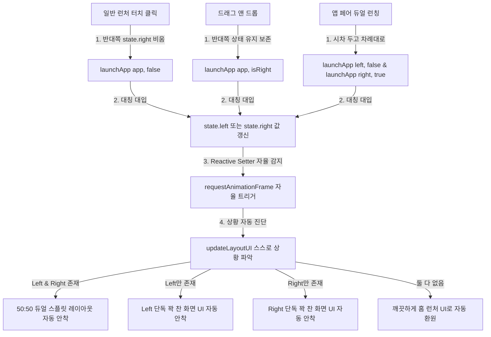

# 🤖 ROS 2 & Full-Stack Monorepo Master - 개발 통합 현황판 (develop_status.md)

> **상태**: 🟢 완벽 수렴 (Convergence Complete)  
> **아키텍처 패러다임**: 100% 대칭형 리액티브 상태 지향 아키텍처 (Symmetrical Reactive State Architecture)  
> **마지막 갱신 일자**: 2026-05-19

---

## 1. 🌟 핵심 아키텍처 혁신 요약

기존에 존재하던 비대칭적이고 지저분한 레거시 찌꺼기인 `browserSplitState` 객체, 스플릿 전용 기형 플래그(`keepSplitState`), 그리고 절차형 수동 렌더링 호출(`updateLayoutUI()`)을 **영구히 전면 통삭제**했습니다.

대신에 가상 디스플레이 2개(VD_1, VD_2)를 동등한 1급 시민 리소스로 바라보는 **`state.left`** 와 **`state.right`** 라는 두 개의 절대적인 독립 실행 정보(SSOT)만을 정의하고, 이 상태의 변화에 따라 뷰가 자동으로 스스로를 갱신하는 **자율 반응형 바인딩**을 이룩했습니다.



---

## 2. 🔄 핵심 상태 관리 및 자율 연동 메커니즘

### 2.1. 100% 리액티브 상태 엔진 (SSOT)
`state.left` 와 `state.right` 의 세터(Setters)는 값의 실제 변동을 칼같이 감지하여, 브라우저가 화면을 갱신하는 가장 안전한 시점인 `requestAnimationFrame` 에 자율적으로 레이아웃 뷰 업데이트를 태웁니다.

```javascript
    // 🔴 대칭적인 2가지 가상 디스플레이 독립 실행 정보 (SSOT 리액티브 상태 엔진)
    let _leftApp = null;
    let _rightApp = null;

    const state = {
        get left() { return _leftApp; },
        set left(app) {
            if (_leftApp === app) return;
            console.log(`[State] Left display app changed: ${app ? app.label : 'null'}`);
            _leftApp = app;
            requestAnimationFrame(() => updateLayoutUI());
        },
        get right() { return _rightApp; },
        set right(app) {
            if (_rightApp === app) return;
            console.log(`[State] Right display app changed: ${app ? app.label : 'null'}`);
            _rightApp = app;
            requestAnimationFrame(() => updateLayoutUI());
        }
    };
```

---

## 3. 🚀 런칭 진입점별 3대 자율 흐름

그 어떤 진입점에서도 `updateLayoutUI()`를 명시적으로 수동 호출하는 하드코딩 사슬은 존재하지 않습니다. 오직 `state`의 값만 투명하게 대입해 주는 것으로 모든 UI 흐름이 자율 연쇄 작동합니다.

### 3.1. 홈 런처 그리드 일반 앱 아이콘 클릭 (단독 실행)
단독 꽉 찬 화면 실행을 의미하므로, 반대쪽 실행 정보를 깨끗이 비워주고 기동합니다. 세터가 자동으로 이를 감지하여 단독 화면 UI로 자동 보정합니다.
```javascript
    if (app.isPair) {
        launchAppPair(app.left, app.right);
    } else {
        // 🔴 낱개 앱 일반 클릭 시에는 단독 실행이므로 반대쪽 실행 정보를 SSOT에 맞춰 비워줍니다!
        state.right = null; 
        launchApp(app, false); 
    }
```

### 3.2. 사이드바 드래그 앤 드롭 런칭 (스플릿 업데이트)
기존 반대쪽 화면을 보존하며 해당 위치의 디스플레이만 갈아끼우는 의도이므로, 상태를 강제로 비우지 않고 그대로 덮어씁니다. 양쪽이 모두 차 있으므로 세터가 자동으로 판단하여 듀얼 스플릿 화면을 온전하게 유지 보정해 줍니다.
* **왼쪽 구역에 드롭 (`launch_left`)**: `launchApp(app, false);`
* **오른쪽 구역에 드롭 (`launch_right`)**: `launchApp(app, true);`

### 3.3. 앱 페어 클릭 (듀얼 시차 런칭)
`launchAppPair` 는 오직 한 쌍의 두 앱이 모두 완벽하게 보장되어 있을 때만 기동하는 극도의 논리적 정합성을 갖추고 있으며, 시차 기동으로 양쪽 상태를 스무스하게 순차 대입합니다.
```javascript
    function launchAppPair(leftPkg, rightPkg) {
        console.log(`[Launcher] Launching App Pair: left=${leftPkg}, right=${rightPkg}`);
        if (Date.now() < launchGuardUntil) return;
        lastLaunchTime = Date.now();

        const targetLeftApp = allApps.find(a => a.packageName === leftPkg);
        const targetRightApp = allApps.find(a => a.packageName === rightPkg);

        if (targetLeftApp && targetRightApp) {
            launchApp(targetLeftApp, false);
            setTimeout(() => {
                launchApp(targetRightApp, true);
            }, 300);
        } else {
            console.warn(`[Launcher] Failed to launch App Pair: one or both apps are missing.`);
        }
    }
```

---

## 4. 📱 미러링 백엔드 서버 (Android / Kotlin) 수명 주기 및 제어 설계

웹 프런트엔드의 대칭 상태가 갱신되면, 백엔드의 Android 시스템 서비스도 이에 매핑되어 가상 디스플레이 및 입력 제어 수명 주기를 투명하게 바인딩합니다.

### 4.1. MirrorForegroundService (백엔드 코어 시스템 서비스)
* **역할**: 미러링의 전반적인 백엔드 전면 생명주기를 주관하는 시스템 코어 서비스.
* **가상 디스플레이 할당 및 소멸 (`VirtualDisplayManager`)**:
  * 장치의 가상 화면 리소스인 `VD_1` (웹 클라이언트의 `state.left` 매핑)과 `VD_2` (웹 클라이언트의 `state.right` 매핑)를 생성 및 해제합니다.
* **인코딩 & 스트리밍 엔진 (`VideoEncoder` / `JpegEncoder`)**:
  * 각 가상 디스플레이의 프레임 버퍼 Surface를 하드웨어 미디어 코덱으로 전달받아 H.264/H.265 또는 MJPEG 스트림으로 실시간 인코딩하여 웹 클라이언트로 전송합니다.

### 4.2. ControlSocket & MirrorServer (웹소켓 명령 통로 브릿지)
* **명령 수신 (`onAppLaunchRequest`)**:
  * 클라이언트로부터 `launchApp` 명령(`pkg`, `componentName`, `pane = primary/secondary`)을 전달받으면, `pane` 정보에 맞추어 안드로이드 멀티 디스플레이 인텐트를 생성하여 `VD_1` 또는 `VD_2` 에 앱을 분기 런칭시킵니다.
* **해상도 및 뷰포트 변경 (`onViewportChange`)**:
  * 듀얼/단독 상태에 따라 클라이언트가 계산해 보낸 `width`, `height`, `pane` 정보를 바탕으로, 해당 가상 디스플레이의 해상도를 실시간으로 재구축(Resize)하여 디코더 가속율과 화질 선명도를 동기화합니다.
* **물리 터치 주입 (`TouchInjector`)**:
  * 브라우저에서 날아온 10바이트 바이너리 터치 패킷의 `pane` 필드(`0=primary(left)`, `1=secondary(right)`)를 판독하여, 안드로이드 가상 디스플레이의 절대 좌표계로 좌표를 변환 및 스케일링한 후 Shizuku/PrivilegedService를 거쳐 각 화면에 독립 주입합니다.

---

## 5. ⚙️ 가상 디스플레이 리사이즈(Resize) 최적화 및 미러링 종료 시 자율 청소(Cleanup) 설계

> [!IMPORTANT]
> **해상도 변동 시 가상 디스플레이를 파괴했다가 재생성(`create` / `release`)하는 방식은 그래픽 리바인딩 지연 및 윈도우 매니저(WindowManagerService)의 순간 얼어붙음(Freeze) 등 시스템 불안정을 유발하는 치명적인 악취입니다.**

### 5.1. 가상 디스플레이 논블로킹 리사이즈 (`VirtualDisplay.resize`)
화면 비율 변경이나 드래그 등으로 해상도가 변경될 때, 기존 가상 디스플레이 인스턴스를 유지하며 내부 API인 `.resize(width, height, densityDpi)`를 직접 호출함으로써 시스템 지연과 무거운 오버헤드를 100% 원천 차단합니다.

* **가상 디스플레이 표준 API 호출**:
  ```kotlin
  // 매번 새로 생성/소멸하는 리바인딩 참사 방지
  virtualDisplay?.resize(newWidth, newHeight, newDpi)
  ```
* **Shizuku / 특권 세션을 통한 윈도우 매니저(`wm`) 대칭 동기화**:
  가상 디스플레이의 크기가 재조정될 때 장치 내부 윈도우 매니저의 해상도 밀도를 강제 정렬하여 레이아웃 찌그러짐을 방어합니다.
  ```bash
  # 가상 디스플레이 ID(-d)를 정교히 추적하여 리사이즈 실행
  wm size 2560x1600 -d <displayId>
  wm density 320 -d <displayId>
  ```

### 5.2. 미러링 종료 시 가상 앱 자율 청소 (Autoclean 및 리셋)
미러링 서비스가 비활성화되거나 가상 디스플레이가 소멸될 때, 해당 가상 화면 위에서 독립 기동 중이던 써드파티 가상 앱들이 백그라운드에서 꼬인 채 좀비로 잔존하지 않도록 확실한 정리 프로세스를 관통시킵니다.

1. **윈도우 매니저 리셋 (`wm reset`)**:
   가상 디스플레이가 시스템 그래픽 메모리를 점유하거나 꼬이지 않도록 즉각 해상도 구성을 완전 초기화합니다.
   ```bash
   wm size reset -d <displayId>
   wm density reset -d <displayId>
   ```
2. **Shizuku/AM 특권 세션을 통한 가상 Activity Task 소거**:
   가상 디스플레이 위에 활성화되어 잔존해 있던 액티비티 스택 전체를 강제 통소거하여 다음 실행 시의 충돌을 원천 예방합니다.
   * **Task 강제 소거**: `am stack terminate` 또는 Shizuku 특권 셸을 이용해 해당 디스플레이 타겟에 기동했던 패키지들을 **`am force-stop <packageName>`** 으로 즉각 물리적 강제 종료 집행.

---

## 6. 🎯 다음 세션 개발자를 위한 인수인계 지도

1. **임의의 UI 렌더링 함수를 수동으로 부르지 마십시오**:
   * 화면 UI 레이아웃을 바꾸고 싶다면, 명시적으로 `updateLayoutUI()`를 호출하지 말고 오직 **`state.left` 와 `state.right` 의 상태 변수에 값을 넣거나 비워주는(null)** 작업만 하십시오. 나머지는 자율 반응 세터가 100% 다 처리합니다.
2. **`browserSplitState` 및 `keepSplitState` 라는 망령 단어를 절대 쓰지 마십시오**:
   * 이 단어들은 역사 속으로 영구 매립되었습니다. 가상 디스플레이 2개는 오직 `left` 와 `right` 라는 이름으로 대칭적으로 존재하며, 뷰포트 해상도 락 또한 `leftLockedViewport` 와 `rightLockedViewport` 독립 변수로 대칭 제어됩니다.
3. **새로운 기능을 붙일 때도 SSOT를 지키십시오**:
   * 예컨대 백엔드로부터 새로운 스트림 제어 신호가 와서 화면을 홈으로 리셋하거나 강제 전환해야 한다면, 오직 `state.left = null; state.right = null;` 대입 한 줄로 상황을 강제 종료하십시오. 뷰와 레이아웃은 그것만으로도 우아하게 100% 완벽 싱크를 맞추며 홈 런처로 되돌아갑니다.
4. **리사이즈 및 앱 클린을 연동할 때 상기 5장의 최적화 수명 주기를 충실히 따르십시오**:
   * 절대로 뷰포트 변경 시마다 `createVirtualDisplay` 를 흔하게 호출하는 과거 방식을 내버려 두지 말고, `virtualDisplay.resize()` 와 `wm` 특권 셸 연동을 구현하십시오.