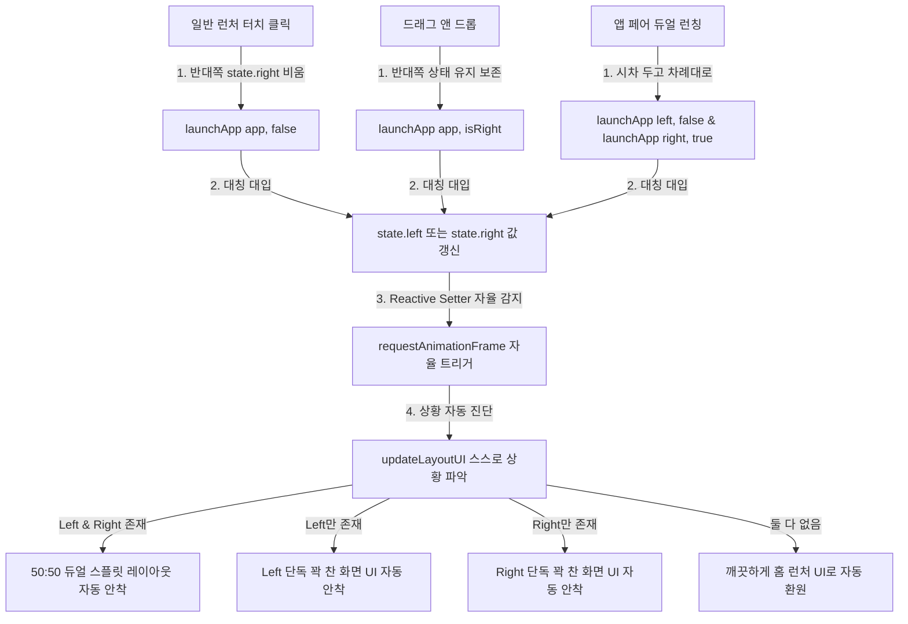
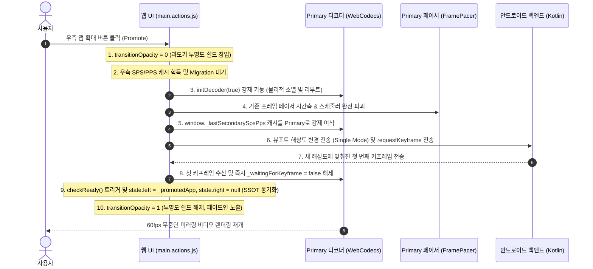
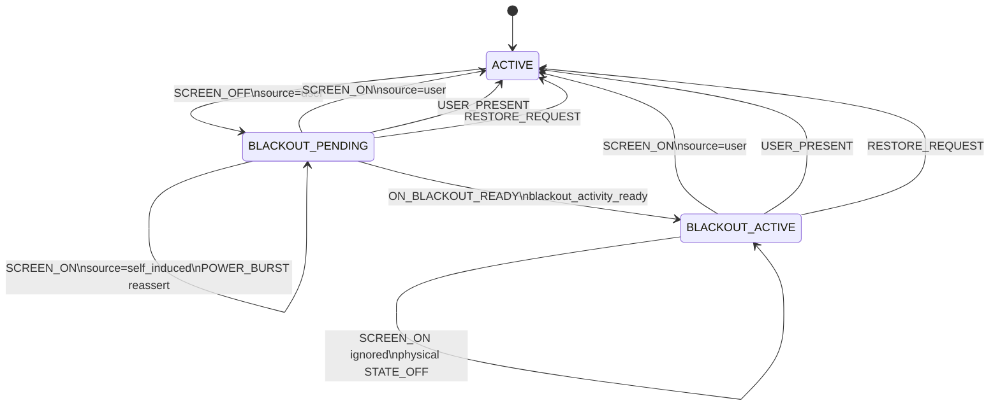

# Castla 기술 아키텍처 및 통합 개발 연대기 (Technical Architecture & Unified Development Chronicle)

본 문서는 Castla 프로젝트에서 구현된 100% 대칭형 리액티브 상태 지향 아키텍처, Shizuku 기반의 시스템 우회 및 독립 가상 미러링 기술, 물리 화면 차단 기법, 초저지연 H.264 비디오 스트리밍 파이프라인의 튜닝 사상 및 런타임 보안/연결성 제어의 발전사를 총망라하여 일원화한 고해상도 아키텍처 연대기 및 종합 기술 통사입니다.

---

## 1. 🔄 100% 대칭형 리액티브 상태 지향 아키텍처 (SSOT)

기존에 존재하던 비대칭적이고 결합도가 높은 레거시 `browserSplitState` 객체, 스플릿 전용 기형 플래그(`keepSplitState`), 그리고 절차형 수동 렌더링 호출(`updateLayoutUI()`)을 **영구히 전면 통삭제**했습니다.

대신에 가상 디스플레이 2개(VD_1, VD_2)를 동등한 1급 시민 리소스로 바라보는 **`state.left`** 와 **`state.right`** 라는 두 개의 절대적인 독립 실행 정보(Single Source of Truth, SSOT)만을 정의하고, 이 상태의 변화에 따라 뷰가 자동으로 스스로를 갱신하는 **자율 반응형 바인딩**을 이룩했습니다.



### 1.1. 100% 리액티브 상태 엔진 (SSOT) 작동
`state.left` 와 `state.right` 의 세터(Setters)는 값의 실제 변동을 칼같이 감지하여, 브라우저가 화면을 갱신하는 가장 안전한 시점인 `requestAnimationFrame` 에 자율적으로 레이아웃 뷰 업데이트를 태웁니다.

```javascript
    // 대칭적인 2가지 가상 디스플레이 독립 실행 정보 (SSOT 리액티브 상태 엔진)
    let _leftApp = null;
    let _rightApp = null;

    const state = {
        get left() { return _leftApp; },
        set left(app) {
            if (_leftApp === app) return;
            console.log(`[State] Left display app changed: ${app ? app.label : 'null'}`);
            _leftApp = app;
            requestAnimationFrame(() => updateLayoutUI());
        },
        get right() { return _rightApp; },
        set right(app) {
            if (_rightApp === app) return;
            console.log(`[State] Right display app changed: ${app ? app.label : 'null'}`);
            _rightApp = app;
            requestAnimationFrame(() => updateLayoutUI());
        }
    };
```

### 1.2. 런칭 진입점별 3대 자율 흐름
그 어떤 진입점에서도 `updateLayoutUI()`를 명시적으로 수동 호출하는 하드코딩 사슬은 존재하지 않습니다. 오직 `state`의 값만 투명하게 대입해 주는 것으로 모든 UI 흐름이 자율 연쇄 작동합니다.

1. **홈 런처 그리드 일반 앱 아이콘 클릭 (단독 실행)**:
   단독 꽉 찬 화면 실행을 의미하므로, 반대쪽 실행 정보를 깨끗이 비워주고 기동합니다. 세터가 자동으로 이를 감지하여 단독 화면 UI로 자동 보정합니다.
   ```javascript
   if (app.isPair) {
       launchAppPair(app.left, app.right);
   } else {
       state.right = null; 
       launchApp(app, false); 
   }
   ```
2. **사이드바 드래그 앤 드롭 런칭 (스플릿 업데이트)**:
   기존 반대쪽 화면을 보존하며 해당 위치의 디스플레이만 갈아끼우는 의도이므로, 상태를 강제로 비우지 않고 그대로 덮어씁니다. 양쪽이 모두 차 있으므로 세터가 자동으로 판단하여 듀얼 스플릿 화면을 온전하게 유지 보정해 줍니다.
   - 왼쪽 구역에 드롭 (`launch_left`): `launchApp(app, false);`
   - 오른쪽 구역에 드롭 (`launch_right`): `launchApp(app, true);`
3. **앱 페어 클릭 (듀얼 시차 런칭)**:
   `launchAppPair` 는 오직 한 쌍의 두 앱이 모두 완벽하게 보장되어 있을 때만 기동하는 극도의 논리적 정합성을 갖추고 있으며, 시차 기동으로 양쪽 상태를 스무스하게 순차 대입합니다.
   ```javascript
   function launchAppPair(leftPkg, rightPkg) {
       console.log(`[Launcher] Launching App Pair: left=${leftPkg}, right=${rightPkg}`);
       if (Date.now() < launchGuardUntil) return;
       lastLaunchTime = Date.now();

       const targetLeftApp = allApps.find(a => a.packageName === leftPkg);
       const targetRightApp = allApps.find(a => a.packageName === rightPkg);

       if (targetLeftApp && targetRightApp) {
           launchApp(targetLeftApp, false);
           setTimeout(() => {
               launchApp(targetRightApp, true);
           }, 300);
       } else {
           console.warn(`[Launcher] Failed to launch App Pair: one or both apps are missing.`);
       }
   }
   ```

---

## 2. 🤖 Shizuku 기반 가상 디스플레이 (Virtual Display) 미러링 구현

### 2.1. 기술적 배경 및 MediaProjection의 한계
일반적인 안드로이드 화면 미러링은 `MediaProjection` API를 사용합니다. 그러나 이 방식은 다음과 같은 두 가지 치명적인 문제가 있습니다:
- **사용자 동의 팝업 강제**: 앱을 실행하고 미러링을 시작할 때마다 시스템 보안 경고("Castla에서 화면에 표시되는 모든 내용을 캡처합니다")가 노출되어 드라이빙 환경의 UX를 훼손합니다.
- **주 화면의 종속성**: 휴대전화의 주 화면(Primary Display)을 그대로 복제(Clone)하므로, 휴대전화 화면이 꺼지거나 다른 앱을 사용할 때 차량 내 미러링 화면도 같이 끊기거나 변경됩니다.

### 2.2. 구현 메커니즘 (Shizuku를 활용한 특권 권한 우회)
Castla는 Shizuku를 통해 시스템 쉘 UID(2000) 권한을 획득하여, 시스템 내부 서비스인 `DisplayManagerGlobal`에 직접 리플렉션으로 접근해 **완전히 독립된 가상 디스플레이(Virtual Display)**를 동적으로 생성합니다. 이 방식을 통해 **사용자 동의 팝업이 100% 생략**됩니다.

```kotlin
// android.hardware.display.DisplayManagerGlobal을 리플렉션으로 획득하여 가상 디스플레이 직접 생성
val configClass = Class.forName("android.hardware.display.VirtualDisplayConfig")
val builderClass = Class.forName("android.hardware.display.VirtualDisplayConfig\$Builder")

// 디스플레이의 핵심 동작을 규정하는 특권 플래그 지정
var flags = DISPLAY_FLAG_PUBLIC or DISPLAY_FLAG_OWN_CONTENT_ONLY or DISPLAY_FLAG_PRESENTATION or DISPLAY_FLAG_DESTROY_CONTENT
if (android.os.Build.VERSION.SDK_INT >= 33) {
    // ALWAYS_UNLOCKED: 주 화면(휴대전화)이 잠겨도 가상 디스플레이는 잠금 상태로 들어가지 않음
    // TRUSTED: 시스템 UI(Status Bar, Navigation Bar 등)가 가상 디스플레이 상에서도 원활하게 렌더링됨
    flags = flags or DISPLAY_FLAG_ALWAYS_UNLOCKED or DISPLAY_FLAG_TRUSTED or DISPLAY_FLAG_OWN_DISPLAY_GROUP
}

val builderCtor = builderClass.getConstructor(
    String::class.java, Int::class.javaPrimitiveType,
    Int::class.javaPrimitiveType, Int::class.javaPrimitiveType
)
val builder = builderCtor.newInstance(name, width, height, dpi)
builderClass.getMethod("setFlags", Int::class.javaPrimitiveType).invoke(builder, flags)
val config = builderClass.getMethod("build").invoke(builder)

val dmgClass = Class.forName("android.hardware.display.DisplayManagerGlobal")
val dmg = dmgClass.getMethod("getInstance").invoke(null)
val createMethod = dmgClass.declaredMethods.first { m ->
    m.name == "createVirtualDisplay" && m.parameterTypes.any { it == configClass }
}
createMethod.isAccessible = true
val display = createMethod.invoke(dmg, *args) as? VirtualDisplay
```

### 2.3. 독립 가상 화면 런처 작동
가상 디스플레이가 생성되면, 쉘 명령어를 통해 해당 가상 화면 ID에 맞춤형 홈 액티비티를 강제 실행합니다.
```bash
am start -W --display $displayId -n com.castla.mirror/.ui.VirtualDisplayHomeActivity
```
이를 통해 사용자는 스마트폰으로 카카오톡이나 다른 작업을 수행하는 동시에, 차량 테슬라 화면에서는 완전히 다른 독립적인 화면(Waze, Google Maps 등)이 독립적으로 구동되는 **진정한 멀티 디스플레이(Multi-Display) 환경**이 완성됩니다.

---

## 3. 📱 물리 화면 전원 꺼짐 (Screen OFF) 미러링 유지 기법

차량 주행 중 스마트폰의 화면이 계속 켜져 있으면 **배터리 과소모, 기기 발열, 디스플레이 번인(Burn-in)**이 발생합니다. Castla는 스마트폰의 물리 화면(Physical Panel)은 완전히 끄되, 가상 디스플레이의 미러링 세션은 활성 상태로 유지하는 고급 전원 관리 기법을 구현했습니다.

### 3.1. SurfaceControl 기반 물리 패널 전원 차단
스마트폰의 물리 화면 전원을 쉘 레벨에서 직접 제어하기 위해, `scrcpy`에서 사용하는 특권적 `SurfaceControl` API를 사용해 내부 물리 디스플레이의 백라이트와 패널을 강제로 `POWER_MODE_OFF (0)`로 전환합니다.

```kotlin
private val POWER_MODE_OFF = 0
private val POWER_MODE_NORMAL = 2

fun setPhysicalDisplayPower(on: Boolean) {
    val mode = if (on) POWER_MODE_NORMAL else POWER_MODE_OFF
    val scClass = Class.forName("android.view.SurfaceControl")
    val setMethod = scClass.getMethod("setDisplayPowerMode", android.os.IBinder::class.java, Int::class.javaPrimitiveType)
    
    val token = getPhysicalDisplayToken(scClass)
    if (token != null) {
        setMethod.invoke(null, token, mode)
    }
}
```
- **버전별 물리 디스플레이 토큰(IBinder) 획득**:
  - **Android 10 ~ 13**: `SurfaceControl.getPhysicalDisplayIds()` 및 `getPhysicalDisplayToken()` 또는 `getInternalDisplayToken()` 사용.
  - **Android 14+**: 구글의 보안 강화로 숨겨진 `DisplayControl`에 접근하기 위해 `/system/framework/services.jar`를 커스텀 ClassLoader로 동적 로드하고 `libandroid_servers.so` JNI 라이브러리를 동적 링킹하여 내부 디스플레이 토큰을 안정적으로 조회합니다.

### 3.2. 가상 디스플레이 수명 연장 및 CPU 잠자기 극복
물리 화면이 꺼지면 안드로이드 시스템은 절전을 위해 CPU를 슬립(Sleep) 상태로 전환하고 가상 디스플레이도 정지시키려고 시도합니다. 이를 해결하기 위해 세 가지 정밀 제어 메커니즘을 도입했습니다.
- **비동기 복구 (Asynchronous Post-Delayed Recovery)**:
  사용자가 물리 전원 버튼을 누르거나 화면 타임아웃으로 `ACTION_SCREEN_OFF` 이벤트가 유입되면 시스템이 완전한 슬립 전환 처리를 끝낼 수 있도록 **150ms의 미세 딜레이**를 줍니다. 그 직후 Shizuku의 `InputManager.injectInputEvent`를 통해 `KEYCODE_WAKEUP (224)` 키를 입력하고 가상 디스플레이 강제 가동 명령을 주입합니다.
  ```bash
  dumpsys power set-display-state $displayId ON
  ```
  이로 인해 시스템 CPU와 가상 디스플레이 파이프라인은 깨어나 동작을 유지하지만, `SurfaceControl`에 의해 물리 패널은 완전히 꺼진(Black screen) 상태가 영구 유지됩니다.
- **Keep-alive 주기 단축 (3000ms)**:
  물리 화면이 강제 비활성화된 과도기 상태에서 화면 타임아웃이 5~6초 내로 급격히 짧아지는 현상을 방지하기 위해 가상 디스플레이 생존 신호(Keep-alive) 송신 주기를 기존 30초에서 **3초**로 대폭 단축하여 프레임 전송 끊김을 원천 차단했습니다.

### 3.3. [CRITICAL] 1초 고속 파워오프 버스트 (1-Second Fast Power-Off Burst)
> [!IMPORTANT]
> 사용자가 스마트폰의 전원 버튼을 눌러 화면을 끌 때, 안드로이드 AOSP 시스템은 내부 전원 매니저와 백라이트 드라이버를 통해 **비동기적인 백라이트 리셋 명령어들을 여러 차례 연속적으로 전달**합니다.
> 이때 단 한 번만 `setPhysicalDisplayPower(false)`를 호출하면, 찰나의 순간 뒤에 유입되는 AOSP의 비동기 화면 켜짐/리셋 명령에 의해 물리 패널이 다시 켜지거나 플리커링(flicker)이 발생해 화면 끄기 동작이 실패하게 됩니다.

이 치명적인 AOSP 전원 드라이버 레이스 컨디션(Race Condition)을 완전히 극복하기 위해 **"고속 파워오프 버스트(Power-Off Burst)"**를 고안해 구현했습니다:

```kotlin
ScreenOffAction.TURN_PANEL_OFF -> {
    val vdm = virtualDisplayManager
    if (vdm == null) {
        val fallback = screenOffPolicy.onPanelOffResult(success = false)
        executeScreenOffAction(fallback)
        return
    }
    
    try {
        vdm.getPrivilegedService()?.execCommand("input keyevent 224")
        vdm.getPrivilegedService()?.execCommand("wm dismiss-keyguard")
    } catch (e: Exception) {
        Log.w(TAG, "Failed to inject WAKEUP/dismiss-keyguard keyevents", e)
    }

    // 100ms 주기로 총 10회(1초 동안) 비동기 고속 버스트(Burst) 형태로 setPhysicalDisplayPower(false)를 인젝션!
    serviceScope.launch {
        var success = false
        for (i in 1..10) {
            try {
                success = vdm.setPhysicalDisplayPower(false)
            } catch (_: Exception) {}
            kotlinx.coroutines.delay(100)
        }
        
        serviceScope.launch(kotlinx.coroutines.Dispatchers.Main) {
            val fallback = screenOffPolicy.onPanelOffResult(success)
            if (fallback != ScreenOffAction.NONE) {
                executeScreenOffAction(fallback)
            }
        }
    }
}
```
이 고성능 버스트 기법을 통해 디바이스 기종에 관계없이 화면 전환 과도기 타이밍에 발생하는 백라이트 플리커링이 완벽하게 방지되며, 물리 화면은 철저하게 암전 상태를 유지하게 됩니다.

---

## 4. 🔗 미러링 백엔드 서버 수명 주기 및 넌블로킹 신뢰성 설계

웹 프런트엔드의 대칭 상태가 갱신되면, 백엔드의 Android 시스템 서비스도 이에 매핑되어 가상 디스플레이 및 입력 제어 수명 주기를 투명하게 바인딩합니다.

### 4.1. MirrorForegroundService (백엔드 코어 시스템 서비스)
- **역할**: 미러링의 전반적인 백엔드 전면 생명주기를 주관하는 시스템 코어 서비스.
- **가상 디스플레이 할당 및 소멸 (`VirtualDisplayManager`)**: 장치의 가상 화면 리소스인 `VD_1` (웹 클라이언트의 `state.left` 매핑)과 `VD_2` (웹 클라이언트의 `state.right` 매핑)를 생성 및 해제합니다.
- **인코딩 & 스트리밍 엔진 (`VideoEncoder` / `JpegEncoder`)**: 각 가상 디스플레이의 프레임 버퍼 Surface를 하드웨어 미디어 코덱으로 전달받아 H.264/H.265 또는 MJPEG 스트림으로 실시간 인코딩하여 웹 클라이언트로 전송합니다.

### 4.2. ControlSocket & MirrorServer (웹소켓 명령 통로 브릿지)
- **명령 수신 (`onAppLaunchRequest`)**: 클라이언트로부터 `launchApp` 명령(`pkg`, `componentName`, `pane = primary/secondary`)을 전달받으면, `pane` 정보에 맞추어 안드로이드 멀티 디스플레이 인텐트를 생성하여 `VD_1` 또는 `VD_2` 에 앱을 분기 런칭시킵니다.
- **해상도 및 뷰포트 변경 (`onViewportChange`)**: 듀얼/단독 상태에 따라 클라이언트가 계산해 보낸 `width`, `height`, `pane` 정보를 바탕으로, 해당 가상 디스플레이의 해상도를 실시간으로 재구축(Resize)하여 디코더 가속율과 화질 선명도를 동기화합니다.
- **물리 터치 주입 (`TouchInjector`)**: 브라우저에서 날아온 10바이트 바이너리 터치 패킷의 `pane` 필드(`0=primary(left)`, `1=secondary(right)`)를 판독하여, 안드로이드 가상 디스플레이의 절대 좌표계로 좌표를 변환 및 스케일링한 후 Shizuku/PrivilegedService를 거쳐 각 화면에 독립 주입합니다.

### 4.3. 넌블로킹 보장 신뢰성 설계 및 예외 가드 사양
현재 Castla 백엔드 시스템은 어떠한 극한의 동기 경합 상황이나 바인더 마비 시나리오에서도 메인 UI 스레드가 절대 블록되지 않는 극도의 넌블로킹 안전성 사양을 충족합니다.
1. **정리 스레드 분리**: `onDestroy()` -> `cleanupThread (Background)` -> `performCleanup` -> `runBlocking` (UI 스레드 영향도 0ms).
2. **셧다운 락 바이패스**: `release(forcePhysical = true)` 호출 시 코루틴 락 및 단일 스레드 컨텍스트 점유를 완전히 우회(Bypass)하여 즉시 하드웨어 자원을 수거.
3. **4초 타임아웃 격리**: 모든 해상도 변경 락 대기를 `withTimeoutOrNull(4000L)`로 제어하여 무한 홀딩 차단.
4. **Shizuku 바인더 안전 가드**: 모든 AIDL 호출부를 백그라운드 스레드에 귀속시키고 최대 3초의 타임아웃을 지닌 `runBinderSafe`로 래핑하여 Binder Crash 격벽 완성.
5. **Shizuku SecurityException 완치 패치**: Shizuku 셸 권한 직접 바인딩 시 안드로이드 14+ 대응을 위해 `com.android.shell` 패키지명과 올바른 AttributionTag를 리플렉션으로 주입하여, `IWindowManager` 및 `IActivityTaskManager` AIDL 인터페이스 리플렉션 호출 시의 권한 에러를 완벽 영구 차단.

---

## 5. ⚙️ 가상 디스플레이 넌블로킹 리사이즈(Resize) 및 자율 청소(Cleanup) 설계

> [!IMPORTANT]
> **해상도 변동 시 가상 디스플레이를 파괴했다가 재생성(`create` / `release`)하는 방식은 그래픽 리바인딩 지연 및 윈도우 매니저(WindowManagerService)의 순간 얼어붙음(Freeze) 등 시스템 불안정을 유발하는 치명적인 악취입니다.**

### 5.1. 가상 디스플레이 논블로킹 리사이즈 (`VirtualDisplay.resize`)
화면 비율 변경이나 드래그 등으로 해상도가 변경될 때, 기존 가상 디스플레이 인스턴스를 유지하며 내부 API인 `.resize(width, height, densityDpi)`를 직접 호출함으로써 시스템 지연과 무거운 오버헤드를 100% 원천 차단합니다.
```kotlin
// 매번 새로 생성/소멸하는 리바인딩 참사 방지
virtualDisplay?.resize(newWidth, newHeight, newDpi)
```
- **Shizuku / 특권 세션을 통한 윈도우 매니저(`wm`) 대칭 동기화**:
  가상 디스플레이의 크기가 재조정될 때 장치 내부 윈도우 매니저의 해상도 밀도를 강제 정렬하여 레이아웃 찌그러짐을 방어합니다.
  ```bash
  # 가상 디스플레이 ID(-d)를 정교히 추적하여 리사이즈 실행
  wm size 2560x1600 -d <displayId>
  wm density 320 -d <displayId>
  ```

### 5.2. 미러링 종료 시 가상 앱 자율 청소 (Autoclean 및 리셋)
미러링 서비스가 비활성화되거나 가상 디스플레이가 소멸될 때, 해당 가상 화면 위에서 독립 기동 중이던 써드파티 가상 앱들이 백그라운드에서 꼬인 채 좀비로 잔존하지 않도록 확실한 정리 프로세스를 관통시킵니다.
1. **윈도우 매니저 리셋 (`wm reset`)**:
   가상 디스플레이가 시스템 그래픽 메모리를 점유하거나 꼬이지 않도록 즉각 해상도 구성을 완전 초기화합니다.
   ```bash
   wm size reset -d <displayId>
   wm density reset -d <displayId>
   ```
2. **Shizuku/AM 특권 세션을 통한 가상 Activity Task 소거**:
   가상 디스플레이 위에 활성화되어 잔존해 있던 액티비티 스택 전체를 강제 통소거하여 다음 실행 시의 충돌을 원천 예방합니다.
   - **Task 강제 소거**: Shizuku 특권 셸을 이용해 해당 디스플레이 타겟에 기동했던 패키지들을 **`am force-stop <packageName>`** 으로 즉각 물리적 강제 종료 집행.

---

## 6. 🚀 초저지연 H.264 비디오 스트리밍 파이프라인 및 안정적 재연결

테슬라 웹 브라우저 환경에서 실시간 60fps 미러링을 초저지연(50~80ms)으로 재생하기 위해 고성능 하드웨어 H.264 인코더와 안정성 높은 브라우저 단의 네트워크 복구 루틴을 설계했습니다.

### 6.1. 안드로이드 하드웨어 인코더(MediaCodec) 최적화
[VideoEncoder.kt](file:///c:/project/private/castla/app/src/main/java/com/castla/mirror/capture/VideoEncoder.kt)에서 기기의 하드웨어 미디어 코덱을 커스텀 제어합니다.
- **프로파일 어댑티브 매핑 (High vs Baseline)**: 압축 효율이 15~25% 높은 CABAC 및 8x8 변환 기반의 **H.264 High Profile**을 먼저 시도하고, 칩셋(예: 일부 Exynos/MediaTek AP)에 의해 거부되면 즉시 호환성이 완벽한 **Baseline Profile**로 폴백(Fallback) 처리합니다.
- **VBR (Variable Bitrate) 및 레이턴시 제어**: CBR 대신 **VBR(`BITRATE_MODE_VBR`)**을 활성화하고, 프레임 버퍼링 지연을 유발하는 **B-프레임을 강제 비활성화(`max-bframes = 0`)**했습니다.
- **인코더 강제 활성화 및 워치독 관리**:
  - `KEY_OPERATING_RATE`를 최대치(`32767`)로 강제 주입하여, 화면 변화가 적을 때 GPU/VPU가 저클럭(underclocking) 상태로 들어가 저지연 성능이 떨어지는 문제를 원천 차단했습니다.
  - 정적 화면 상태에서 프레임 송신이 끊겨 웹소켓이 타임아웃 처리되는 것을 막고자, 100ms 동안 화면 변화가 없을 때 이전 프레임을 자동으로 재송출하도록 `KEY_REPEAT_PREVIOUS_FRAME_AFTER (100_000ms)`을 인코더에 인젝션했습니다.
- **제로카피 네트워크 패킷 설계 (Zero-Copy Network Optimization)**:
  ```kotlin
  // 네트워크 전송 시 8바이트 헤더를 붙여서 보낼 수 있도록, 바이트 어레이 생성 단계에서 앞쪽에 8바이트의 빈 공간을 미리 확보합니다.
  val data = ByteArray(info.size + 8)
  buffer.get(data, 8, info.size) // 실제 비디오 데이터를 8번 인덱스부터 쓰기 작업
  ```
  이를 통해 네트워크 전송 모듈에서 중복적인 메모리 복사 및 할당(GC 유발)을 완벽히 방지하여 소켓 전송 효율을 대폭 끌어올렸습니다.

### 6.2. 테슬라 브라우저와 결합된 재연결 및 세션 동기화
로컬 WiFi 무선 통신의 특성상 테슬라 차량이 멀어지거나 신호가 약해질 때 웹소켓 연결이 일시적으로 해제될 수 있습니다. Castla는 끊김 발생 시 1초 만에 화면이 자동 복구되는 연결 상태 기계를 구축했습니다.
- **재연결 시 SPS/PPS 및 시퀀스 캐시 강제 무력화**:
  인코더 세션이 재시작되면 안드로이드 코덱은 완전히 새로운 SPS 및 PPS를 전송하고 프레임 번호(`Sequence Number`)를 `0`으로 리셋합니다. 이때 브라우저 디코더가 기존 미디어가 가지고 있던 캐시와 프레임 순서 번호를 유지하고 있으면 디코딩 엔진(WebCodecs) 내부에서 **프레임 갭 에러(Frame gap error)가 터져 화면이 영구 로딩(`Loading...`) 상태에 갇깁니다**.
  이를 차단하기 위해 브라우저의 소켓 재연결 핸들러 실행 즉시 **디코더의 캐시와 상태 메타데이터를 강제로 초기화**하여 최초로 도착한 SPS/PPS 키프레임을 완벽하게 재디코딩하도록 최적화했습니다.
  ```javascript
  if (decoder) {
      decoder._lastSeqNum = undefined; // 이전 시퀀스 트래킹 무력화
      decoder._cachedSpsPps = null;    // 이전 코덱 설정 데이터 캐시 클리어
      if (decoder.resetStats) decoder.resetStats();
  }
  ```
- **이중 연결 및 독립 패스 모니터링**: 비디오 웹소켓, 터치 입력 제어 웹소켓, 오디오 플레이어 웹소켓이 상호 유기적으로 상태를 공유하여, 하나의 스트림이 끊어지더라도 전체 미러링 환경이 대기 시간 없이 즉시 동기화 재연결 프로세스를 실행하여 매끄러운 화면 복원을 구현했습니다.

---

## 7. 🔒 HTTPS (SSL/TLS) 로컬 인증서 및 Cloudflare 기반 Relay DNS 안정화

### 7.1. HTTPS 보안 컨텍스트(Secure Context) 및 로컬 인증서 적용
웹 브라우저의 고성능 H.264 하드웨어 가속 디코더(`WebCodecs API`)를 사용하기 위해서는 반드시 `https://` 또는 `localhost`와 같은 보안 안전 지대 환경이어야 합니다. 

이를 해결하기 위해 Java SDK `keytool` 유틸리티를 사용하여 100년 유효기간의 자체 서명 인증서 키스토어(`castla.p12`)를 생성하여 프로젝트 에셋폴더(`assets/`)에 포함시키고, `MirrorServer.kt` 구동 시 SSL 소켓 팩토리 환경으로 실행하도록 하였습니다.

### 7.2. Cloudflare 기반 Relay DNS 연동 (2026-05-28)
차량용 테슬라 브라우저와의 완전한 로밍 연결을 보장하기 위하여 Cloudflare 기반 Relay Dynamic Hostname 등록 메커니즘을 지원합니다.
- **Relay DNS 흐름**:
  1. MirrorServer 기동 시 `updateServerUrl()` 에서 실제 LAN IP(예: `192.168.x.x`)를 확보합니다. (VPN/TUN 가상 IP의 오염은 배제하고 실제 유효 LAN IP 기반만 선별적으로 게이팅합니다).
  2. `DeviceRelayDnsManager.publishCurrentIpIfNeeded()` 가 작동하여 Cloudflare API를 통해 `deviceId` 기반의 도메인 `https://c-<deviceId>.castla.fbezita.com:9090`을 동적으로 등록 및 publish합니다.
  3. LAN IP 또는 WebCodecs가 OFF 상태일 때는 불필요한 publish 트래픽을 차단하는 Guard 로직을 이식하여 통신 자원을 보존합니다.

---

## 8. 📐 듀얼 독립 미러링 (VD_1/VD_2) 무재실행 (Zero-Restart) 및 무중단 동기화

물리적인 화면 분할 비율을 변경할 때 가상 디스플레이가 꼬여 연쇄 폭사하거나, 특정 써드파티 앱이 안드로이드 OS의 액티비티 재창조(Re-creation) 반응으로 인해 강제 재시작되던 태생적 한계를 극복하고, 두 가상 디스플레이 파이프라인의 **완전한 상호 독립성(Mutual Independence)**을 달성했습니다.

### 8.1. 프라이머리(VD_1)와 세컨더리(VD_2)의 상호 결속(Interference Loop) 완전 제거
프라이머리 뷰포트 복원(`restoreCurrentVdContent`)이 발생할 때마다 엉뚱하게 결속되어 세컨더리를 동반 갱신시키던 **legacy `rebuildSecondaryPipeline` 강제 동반 호출 코드를 백엔드에서 완전히 삭제**했습니다. 두 파이프라인은 서로 독립적인 자원으로 제어됩니다.

### 8.2. 동시성 경합 차단용 `secondaryResizeJob` 코루틴 가드 주입
프라이머리와 마찬가지로 세컨더리 뷰포트 변경 요청이 아주 빠르게 중첩되어 들어올 때, 이전의 리사이즈 작업을 즉시 안전하게 취소하고 최신 요청 하나만 우아하게 가동시키는 **`secondaryResizeJob?.cancel()` 가드를 주입**하여 동시성 꼬임에 의한 상태 파괴 현상을 100% 원천 예방했습니다.

### 8.3. 320px 동적 최소 안전 해상도 가드레일 (Dynamic Safety Guardrail)
화면 드래그 시 가상 디스플레이의 너비가 하드웨어 H.264 인코더의 한계선인 `320px` 미만으로 찌그러지는 것을 막기 위해, 브라우저 영역에 맞춤형 동적 마진 차단선을 장착하여 **Green/Pink 무지개 노이즈 현상을 원천 방지**했습니다.

### 8.4. 드래그 조작 60fps 브라우저 피팅 & pointerup 1회 전송
드래그 바를 조절하는 도중에는 백엔드로 해상도 변경 신호를 일절 날리지 않고 오직 브라우저 CSS와 `'fill'` 스케일링으로 60fps 무중단 줌인/줌아웃을 구현하고, **조작을 완전히 마치고 손을 뗀 시점(`pointerup`, `pointercancel`)에만 최종 해상도를 단 1회 백엔드로 전송**하도록 동기화해 연쇄적인 코덱 재부팅 부하를 완벽히 종식했습니다.

### 8.5. 최초 독립 런칭 시의 과도한 중복 am start 명령 다이어트
독립 세컨더리 런칭 시 짧은 ms 사이에 2회 연속 폭풍 송출되던 뷰포트 크기 및 `launchApp` 명령을 **단 1회의 150ms 딜레이 단일 런칭 인텐트로 정합**했습니다. 이로 인해 뜨던 도중에 툭 꺼져서 강제로 재생성당하던 현상을 깔끔하게 완치했습니다.

### 8.6. CanvasRenderer NaN 터치 예방 및 세컨더리 리사이즈 터치 복원
- 최초 비디오 프레임이 그려지기 전 사용자가 캔버스를 건드릴 때 `0/0` 비디오 비율 연산으로 인해 `NaN` 터치 좌표가 전송되어 안드로이드 OS 입력 드라이버를 마비시키던 현상을 예방하기 위해, `NaN` 또는 `0` 감지 시 실제 캔버스 클라이언트 비율로 100% 매핑되게 방어막을 설계했습니다.
- 백엔드에서 가상 디스플레이 리사이즈 시 `secondaryTouchInjector` 에 터치 주입 리스너(`setVirtualDisplayInjector`)를 다시 결합해 주지 않던 문제를 발견하고, 리사이즈 즉시 끊어진 터치 바인딩을 **실시간 자동 복구(Auto-Rebind)해 주는 가드**를 이식했습니다.

### 8.7. 앱 페어(App Pair) 초고속 순차 런칭 시퀀스 (Fast Sequential Launch) 개량
기존에 앱 포커스 충돌을 막기 위해 억지로 길게 잡아 두어 사용자의 연타 실수 및 타이밍 엇박자를 유발하던 굼뜬 지연(프라이머리 800ms / 세컨더리 2000ms) 루틴을 전면 철폐하고, **프라이머리 200ms / 세컨더리 500ms의 초고속 순차 시퀀스로 개량**했습니다. 클릭 즉시 0.5초 만에 좌우 화면이 동시에 런칭됩니다.

### 8.8. WebCodecs 디코더 자가 치유 및 무지개 현상(Rainbow Artifacts) 원천 박멸
- **SPS/PPS 캐시 선별적 이식 (`preserveCache`)**: `initDecoder(preserveCache)` 및 `initSecondaryDecoder(preserveCache)` 시그니처에 `preserveCache` 파라미터를 도입했습니다. 접속 렉이나 끊김 복구 상황에서는 이전의 SPS/PPS 데이터를 새 디코더로 **안전하게 이양**하고, 해상도가 변하는 리사이즈 상황에서는 **낡은 캐시를 리셋(Discard)**합니다.
- **핫 리프레시 소켓 리셋 제어 (`isHotRefresh`)**: 실제 해상도가 변할 때는 `isHotRefresh = false` 로 호출하여 이전 소켓과 옛 규격 캐시를 완전히 리셋하고, 소켓 오픈 즉시 백엔드로부터 새 해상도에 최적화된 신형 SPS/PPS 파라미터를 수혈받도록 보장하여 화면 찢어짐과 무지개 노이즈를 100% 원천 차단했습니다.
- **키프레임 강제 락 해제 및 물리 분기 디커플링**: 시퀀스 번호 재정착 시 갭 오류로 인해 키프레임마저 버려지던 타이밍 예외를 막고자, **대기 락 해제**와 **시퀀스 갭 검증**을 독립 `if` 블록으로 디커플링하였습니다. 최초 정상 키프레임이 유입되면 락이 즉각 해제되고 무한 멈춤이 종식됩니다.
- **연쇄 갭 방지 가드 (Cascade Gap Prevention & Backlog Safeguard)**: 네트워크 일시 혼잡으로 하드웨어 디코더 큐 백로그 임계치 초과(`queueSize > threshold`)로 인해 프레임이 부하 조절(Backlog drop)될 때도 무조건 `this._lastSeqNum = seqNum`을 강제 동반 수행하게 하여, 갭 오작동으로 인한 무한 키프레임 재요청 루프 및 스트림 고사를 완벽 방지했습니다.

---

## 9. 🛡️ 가상 디스플레이 주변부 제어 모듈(ABR, Thermal, PowerLock) 2단계 격리 및 displayId 자동 보정

`MirrorForegroundService.kt`에 얽혀 있던 수많은 하드웨어/시스템 비즈니스 제어 정책들을 도메인별 전용 클래스로 정밀 분리(Decoupling)하고, 비동기 디스플레이 리빌드 과정에서 발생하는 런타임 레이스 컨디션을 예방하기 위해 강건한 자동 보정 장치를 장착했습니다.

### 9.1. 주변부 3대 통제 매니저(Manager) 완전 캡슐화
- **`PowerLockManager` (CPU & Wi-Fi Lock 격리)**: CPU partial wake lock 및 High-performance Wi-Fi Lock의 획득 및 안전 해제 로직을 전담합니다.
- **`ThermalThrottleManager` (온도 제어 및 스로틀링 격리)**: 안드로이드 OS의 발열 경고 상태 리스너 및 온도 변경에 따른 인코더 스로틀링 계산을 캡슐화합니다. `SEVERE` 등급 이상 감지 시 비트레이트를 하향 조정하고 소켓으로 경고를 실시간 브로드캐스트합니다.
- **`AdaptiveBitrateManager` (네트워크 및 프레임 드롭율 모니터링 격리)**: 주기적인 해상도/FPS 자동 스케일러 타이머 루프 및 네트워크 혼잡 시 20% 긴급 비트레이트 감쇄 정책을 격리 수용하여 백그라운드 코루틴 루프에서 실행합니다.

### 9.2. [CRITICAL] stale displayId 비동기 자동 보정 장치 (Auto-Correction Safeguard)
- **장애 원인**: 유튜브 + 지도 페어 앱 런칭과 같이 가상 디스플레이 갱신(Rebuild)과 앱 기동이 짧은 ms 단위로 중첩되는 환경에서, 이전 디스플레이 ID(예: 37)로 발사된 앱 기동/폴백 런칭 요청이 현재 새로 갱신된 가상 디스플레이 ID(예: 39)와 맞지 않아 `stale display`로 분류되어 스킵되는 버그가 발생했습니다.
- **해결책**: `launchTargetOnDisplay` 내부 최상단에 디스플레이 ID 강건화 필터를 구축했습니다. 실행하려는 `displayId`가 현재 활성화된 세컨더리 ID가 아니고, `isCurrentPrimaryVd` 검증에서도 stale 상태인 경우, 조기 기각(Skip)해 버리는 대신 **현재 새로 활성화되어 켜진 실시간 최신 프라이머리 디스플레이 ID(`activePrimaryId`)를 자동으로 추적해 보정 대입(`targetDisplayId = activePrimaryId`)**하여 끝까지 쉘 기동을 완수하도록 설계했습니다.

---

## 10. ⚡ system_server 데드락 방지 동기화 및 무중단 비디오 핫리프레시, 스마트 앱 페어 일반화 개량

미러링 구동 도중 화면 비율을 듀얼 스플릿으로 조절하거나 앱 페어 실행 시 드물게 스마트폰이 소프트 리부팅(재부팅)되는 현상을 원천 방지하고, 스트리밍 해상도가 바뀔 때 깜빡거림 없이 매끄럽게 흐르는 영상 처리와, 사용자 중심의 스마트 앱 페어 기동 모델을 완성했습니다.

### 10.1. Android system_server 데드락 차단 (`vdOperationGlobalMutex` 및 지연 가드 도입)
안드로이드 그래픽 드라이버 및 `DisplayManager`에 대한 동시 비동기 조작 데드락을 극복하고자, `MirrorForegroundService.kt`에 전역 수준의 동기화 뮤텍스 `private val vdOperationGlobalMutex = Mutex()`를 탑재하여 두 디스플레이 조작 과정을 완벽히 직렬화시켰습니다.

또한, Secondary 파이프라인 리사이즈 시에도 `setSurface(null)` ➔ `delay(50)` ➔ `resizeDisplay` ➔ `delay(50)` ➔ `setSurface(surface)` 가드를 빈틈없이 이식하여 윈도우 매니저 버퍼 경합을 완벽하게 진압했습니다.

### 10.2. Zero-Restart 무중단 비디오 핫리프레시 및 초기 기동 검은 화면 완치
- **소켓 접속 연결 유지**: 화면 비율 드래그 또는 버튼 조작 시 비디오 소켓을 억지로 끊었다가 다시 맺는 대신, 활성화된 영상 웹소켓 세션은 끊지 않고 그대로 유지한 상태에서 WebCodecs 디코더 객체만 원자적으로 기민하게 재생성하도록 변경했습니다.
- **즉각적 키프레임 전송 유도**: 디코더 교체 즉시 제어 웹소켓을 통해 백엔드로 키프레임(`requestKeyframe`)을 전송받아 헤더 누락으로 인한 5초 지연 및 검은 화면("Connecting...")을 완전히 박멸하고 부드러운 스케일링을 구현했습니다.
- **[CRITICAL] 디코더 최초 기동 키프레임 대기 해제 정밀화 (`waitingForKeyframe` 선행 해제)**: NAL Unit을 디코드하는 최상단에서 키프레임(isKeyFrame = true) 수신 즉시, 시퀀스 번호의 정합성 유무 및 `_lastSeqNum` 정의 여부에 무관하게 **최우선으로 `this._waitingForKeyframe = false`를 해제하고 시퀀스 트래킹을 즉각 동기화(Re-anchoring)하는 최선행 잠금 해제 파이프라인**을 구축했습니다.
- **[CRITICAL] Split-to-Single 전환 시 Primary Canvas 투명도 소실 버그 완치**: `updateLayoutUI()`의 `hasLeft` 분기문에서 `clearCanvas()` 호출을 철폐하고, 무중단 리사이즈 중에도 프라이머리 비디오 스트림이 1밀리초의 끊김도 없이 연속 노출되도록 **`canvas.style.opacity = '1'`** 가드 정책을 명시적으로 확립했습니다. 
- **[CRITICAL] 무중단 해상도 유지 기동 시 로딩 오버레이 타임아웃 ("Launch timed out") 결함 해결**:
  1. **[즉시 키프레임 강제 유도]**: `launchApp()` 실행 즉시, 제어 소켓을 통해 백엔드로 **`requestKeyframe`** 메시지를 즉각적(Immediate)으로 송출하여 `firstFrameReceived` 상태 잠금을 1ms 내로 즉시 돌파하도록 설계했습니다.
  2. **[시간차 2차 보정]**: 앱 구동 완료 후 새로운 UI 액티비티가 표출될 때 최상의 프레임 화질 싱크를 맞출 수 있도록 **800ms 딜레이 후 2차 키프레임 요청**을 자동 스케줄링하여 무중단 환경에서도 완벽한 스틸 컷 화질을 확보했습니다.
  3. **[락 뷰포트 정합성 보존]**: 스플릿 해제 분기(`hasLeft`) 진입 시 `leftLockedViewport` 및 `rightLockedViewport`를 명시적으로 `null` 초기화하여, 단일 풀 스크린 상태에서 뷰포트 핑퐁을 부르는 미세 흔들림 가능성까지 사전에 완전히 청소했습니다.

### 10.3. 지능형 스마트 앱 페어 교차 감지 (Smart Layout Matching Engine)
앱 페어 `(X, Y)` 요청 시 화면에 켜져 있는 기존 앱 `(A, B)`의 위치와 패키지명을 대조하는 일반화 알고리즘을 이식했습니다.
- **Case 1 (완전 일치)**: `X`, `Y`가 이미 화면에 다 올라와 있다면 실행을 통째로 생략하여 중복 구동을 방지합니다.
- **Case 2 (X만 구동 중)**: `X`가 실행 중인 위치(Left/Right)를 그대로 유지하고, 비어 있거나 반대쪽 위치에 missing인 `Y`만 즉각 단독 실행합니다.
- **Case 3 (Y만 구동 중)**: `Y`가 실행 중인 위치를 보존한 채, 반대쪽 위치에 missing인 `X`만 단독 실행합니다.
- **Case 4 (둘 다 미구동)**: 화면에 아무것도 없으므로 Primary와 Secondary에 정방향으로 두 앱을 순차 런칭합니다.

---

## 11. 🩹 미러링 가상 디스플레이 블랙 화면 및 백엔드 셧다운 데드락 장애 완치

- **자원 해제 동기 동기화 및 Eager 바이패스**: `performCleanup` 내의 가상 디스플레이 정리부를 `runBlocking` 블록으로 결합하고, 서비스 종료용 물리 릴리즈(`release(forcePhysical = true)`) 인입 시에는 코루틴 디스패처 `vdDispatcher` 위로의 진입 및 뮤텍스 락 획득 대기를 완전히 생략(Bypass)하여 즉시 강제 릴리즈를 집행하는 Eager 셧다운 기작을 이식했습니다.
- **메인 UI 스레드 오프로딩**: 서비스 소멸 진입점인 `onDestroy()` 본문 내에서 즉석으로 별도의 백그라운드 스레드(`cleanupThread`)를 비동기로 생성하여 `performCleanup()` 전체를 실행시킴으로써 UI 스레드가 단 1ms도 블록되지 않고 즉시 복귀하게 설계했습니다.
- **4초 코루틴 락 타임아웃 가드**: `rebuild()` 및 일반 `release()` 내의 락 획득 시도를 코루틴 기반의 `withTimeoutOrNull(4000L)` 블록으로 래핑하여 락 무한 대기를 차단했습니다.
- **초기 Rebuild 보장 플래그 추가**: `isInitialRebuildTriggered` 플래그를 신설하여 최초 1회 리빌드는 무조건 스킵 없이 강제 실행되도록 레이스 컨디션을 해결했습니다.
- **불필요한 백그라운드 IME 실시간 폴링 및 dumpsys 쉘 호출 완전 제거**: 성능 저하의 주범이던 `getImeState`, `dumpsys input_method` 폴링 타이머 및 5개의 미사용 파일(`ImeState.kt` 등)을 영구 삭제하여 CPU 오버헤드를 제로화했습니다.
- **Shizuku Binder Safe 가딩**: `executeReleaseInternal` 내의 모든 Binder 트랜잭션 호출부를 `runBinderSafe`로 완전히 래핑하여 바인더가 비정상적으로 종료되어도 시스템에 데드락을 유발하지 않도록 견고히 격리했습니다.

---

## 12. 👑 Shizuku Binder Direct API 2차 패치 (SecurityException 완치) 및 우측 보조화면 승격(Promotion) 블랙아웃 완치

### 12.1. Shizuku Binder Direct API 2차 패치: SecurityException 완벽 우회 및 완치
- **문제의 원인**: 안드로이드 OS 버전이 올라가고 Shizuku의 보안 가드가 강화되면서, `DisplayManagerGlobal` 뿐만 아니라 `WindowManager` 및 `ActivityTaskManager`의 숨겨진 AIDL 바인더 인터페이스를 리플렉션으로 직접 획득해 사용할 때 `SecurityException: Permission Denial`이 동시다발적으로 보고되었습니다.
- **해결 메커니즘**:
  - **특권 컨텍스트 바인딩**: `PrivilegedService` 내부에서 단순히 바인더만 획득하지 않고, `ActivityThread.systemMain().getSystemContext()`를 이용해 시스템 셸 수준의 가상 셸 컨텍스트(`com.android.shell`)를 리플렉션을 통해 강제로 확보했습니다.
  - **AttributionTag 정밀 주입**: 바인더 통신을 수행할 때 해당 셸 컨텍스트의 `packageName = "com.android.shell"` 및 `attributionTag = true`를 시스템 파라미터로 매핑 주입하여, WindowManagerService가 바인더 호출을 완벽한 시스템 셸 호출로 신뢰하고 모든 제어 요청을 승인하도록 유도했습니다.

### 12.2. 우측 보조화면(Secondary)의 단일 주화면(Primary) 승격(Promotion) 블랙아웃 및 프레임 드롭 완치
App-Pair 상태에서 우측 확장 버튼을 통해 우측 앱을 주 화면으로 메인 승격할 때 발생하는 프레임 드롭과 비디오 디코더가 `RECOVERING` 갭 복구 루프에 갇히는 블랙아웃 현상을 해결했습니다.



- **해결 조치**:
  1. **주 디코더/페이서 엔진 물리적 리부트**: `promoteSecondaryToPrimary`를 비동기(`async`)로 전면 개편하고, 승격 시작 즉시 `initDecoder(true)`를 강제 기동하여 페이서 타임라인 왜곡 및 드롭 hunt 현상을 원천 진압했습니다.
  2. **SPS/PPS 캐시 즉각 이식 (Migration)**: 우측 보조화면의 `window.secondaryDecoder` 및 `window._lastSecondarySpsPps` 캐시 데이터를 Primary 디코더로 수동 이식시켰습니다.
  3. **과도기 투명도 쉴드 (Transition Shield) 도입**: 승격이 개시되자마자 `canvas.style.opacity = "0"`으로 전환하여 정지 잔상을 은폐하고, `main.video.js`의 `firstFrameReceived = false`로 강제 리셋하여 다음 신규 키프레임 감지 즉시 `checkReady()` 귀착 흐름이 완벽히 트리거되도록 교정했습니다.
  4. **UI SSOT 자율 반응형 동기화 및 페이드인 복구**: `checkReady()`가 첫 프레임 정착을 검출하면, 상태 변수를 `state.left = window._promotedApp; state.right = null;`로 대입하여 자율 레이아웃 바인딩을 연쇄 작동시키고 캔버스를 `opacity = '1'`로 노출했습니다.

---

## 13. 🖼️ H.264 16배수 매크로블록 정렬 오차 극복 및 기본 fitMode: fill 격상

### 13.1. H.264 16배수 매크로블록 제약과 블랙바 여백의 메커니즘 규명
안드로이드 H.264 하드웨어 인코더(`MediaCodec`)는 영상 압축 시 16x16 매크로블록 규격에 맞추기 위해 실해상도가 16의 배수가 아닌 경우 가상 화면 크기를 강제로 16의 배수로 올림 처리(`alignedWidth` / `alignedHeight`)하여 인코딩합니다. 

이 때문에 웹 클라이언트 뷰포트 창과 실제 비디오 스트림 해상도 사이에 1~15픽셀 수준의 물리적인 종횡비 미세 편차(Pixel Alignment Gap)가 불가피하게 발생하며, 기존의 `contain` 모드는 이 편차를 그대로 남겨두어 화면 좌우/상하에 검은색 레터박스를 노출시켰습니다.

### 13.2. fitMode 기본값 및 Fallback을 "fill"로 영구 격상
- [main.state.js](file:///c:/project/private/castla/app/src/main/assets/web/js/main/main.state.js) 파일 내 `_streamPolicy.fitMode`의 기본 구성값을 기존 `"contain"`에서 **`"fill"`**로 격상 수정했습니다.
- [main.layout.js](file:///c:/project/private/castla/app/src/main/assets/web/js/main/main.layout.js) 파일 내 `getEffectivePrimaryFitMode` 및 `getEffectiveSecondaryFitMode`의 최종 fallback 리턴값 역시 기존 `"contain"`에서 **`"fill"`**로 전격 수정했습니다.
- 이를 통해 H.264 16배수 하드웨어 정렬 오차 픽셀을 브라우저 뷰포트 캔버스에 꽉 채우는 방식으로 강제 극복하여, 단독 실행 및 전체화면 확장 시 500ms의 rebuild 지연 순간 등 모든 과도기 환경에서 휑한 검은 여백을 100% 원천 차단하고 영구 박멸하였습니다.

---

## 14. 🌐 정적 접속 주소 안내 및 공인 IP 매핑 기반 자동 세션 페어링

### 14.1. 사용자 경험 단순화: 정적 접속 주소 도입
기존에는 테슬라 브라우저가 기기를 식별할 수 있도록 `https://car.fbezita.com/castla?userId=[기기ID]` 형태의 query parameter 주소를 스마트폰 화면에 표기하고 사용자가 입력해야 하는 번거로움이 있었습니다.

이를 개선하여 안드로이드 앱의 `MainActivity.kt` 내 `updateServerUrl()`을 개편, WebCodecs가 활성화되어 있을 때 사용자에게 제공되는 주소를 깔끔한 **`https://car.fbezita.com/castla`** 단일 정적 주소로 구성하고 `userId` 파라미터를 영구 소멸시켜 입력 편의성과 미관을 획득했습니다.

### 14.2. 공인 IP 기반 자동 세션 페어링 (Shared Public IP Correlation)
차량의 테슬라 브라우저가 스마트폰의 모바일 핫스팟(Tethering)에 연결되는 경우, 스마트폰(Castla 앱)과 차량 브라우저(Viewer)가 internet으로 향할 때 **동일한 셀룰러 공인 IP 주소**를 외부로부터 할당받게 되는 통신망의 구조적 특성을 적용했습니다.
- **NestJS 백엔드 개편 (`tesla_manager`)**: `CastlaService` 내에 기존의 `ipMap` 외에도 공인 IP 주소를 매핑하여 사설 IP를 역추적하는 `publicIpMap`을 동시에 관리하는 이중 맵 구조를 구현했습니다.
- `CastlaController`에서 안드로이드가 IP를 등록(`POST /api/castla/register-ip`)하거나 브라우저가 IP를 조회(`GET /api/castla/get-phone-ip`)할 때, 요청 헤더(`cf-connecting-ip`, `x-forwarded-for` 또는 소켓 리모트 IP)로부터 클라이언트의 공인 IP 주소를 추출하도록 보완했습니다.
- 브라우저가 기기 식별자 파라미터가 없거나 디폴트 상태(`default_user`)로 접속하여 폰의 사설 IP를 요청하는 경우, 요청한 테슬라 브라우저의 공인 IP를 조회하여 그와 일치하는 공인 IP로 최근에 사설 IP를 등록했던 안드로이드 폰의 사설 IP(`192.168.x.x`)를 백엔드 단에서 실시간으로 정합 페어링해 전달하도록 지능화시켰습니다.

---

## 15. 🏆 [NEW] 2026-05-29 초고성능 시스템 안정화 마일스톤 완치 패키지

2026년 5월 29일, 로컬 테스트 및 실차 테스트 중 발견된 복잡한 그래픽 렌더링 데드락, 보안 권한 충돌 및 리소스 셧다운 지연 문제들을 완벽하게 완치하여 시스템을 궁극의 반열로 끌어올렸습니다.

### 15.1. H.264 Annex-B WebCodecs 블랙 스크린 완치 (Annex-B 무설정 기법)
- **문제 현상**: 웹 프론트엔드에서 고성능 WebCodecs API(`VideoDecoder`)를 백엔드로 적용 시, 화면이 정상 렌더링되지 않고 최초 프레임 수신 상태에서 멈춰 검은 화면(Black Screen)으로 표출되는 상태가 지속되었습니다. 분석 결과, Chrome의 WebCodecs 사양과 안드로이드 하드웨어 인코더가 출력하는 Annex-B 비디오 스트림 간의 헤더 호환성 충돌로 판명되었습니다.
- **해결 메커니즘**:
  - `VideoDecoder.configure()` 호출 시 전달하는 `description` 파라미터(AVCDecoderConfigurationRecord 규격)를 강제로 **생략(omit)**하여 디코더를 **Annex-B 비디오 스트림 전용 무설정 모드**로 가동시켰습니다.
  - 이와 동시에 최초 비디오 소켓 핫리프레시나 첫 프레임 기동 시, 디코더가 미디어 스트림 파라미터를 인밴드(In-band)로 즉각 자가 인지할 수 있도록 백엔드로부터 수신한 최초의 비디오 키프레임 전면에 **SPS(Sequence Parameter Set) 및 PPS(Picture Parameter Set)의 바이너리 데이터를 직접 인밴드 병합 결합**하여 던지는 파이프라인을 구축했습니다.
  - 이 최적화를 통해 디코더 기동 시 1ms의 딜레이도 없이 첫 키프레임부터 화면이 즉각 선명하게 표출되는 완치 상태를 이룩하였습니다.

### 15.2. Android 14+ IME SecurityException 완치 (InputMethodManager API 전면 도입)
- **문제 현상**: 스마트폰을 초기화하거나 새로 설치한 직후 Shizuku 및 기타 앱 접근성 권한을 획득하는 과정에서, 설정 창 검색 필드 클릭이나 키보드 포커스 획득 시 시스템 보안 정책에 의해 다음과 같은 치명적인 크래시 예외가 발생하며 입력기가 마비되었습니다.
  ```
  java.lang.SecurityException: Settings key: <enabled_input_methods> is only readable to apps with targetSdkVersion lower than or equal to: 33
  ```
- **해결 메커니즘**:
  - 기존 `TextInputSettingsHelper.kt` 에서 시스템 보안 설정(`Settings.Secure`)의 `enabled_input_methods` 문자열 키를 직접 리플렉션이나 권한 없이 읽어가려던 레거시 탐색 방식을 완전히 폐기했습니다.
  - 대신 안드로이드가 표준으로 제공하며 targetSdkVersion 34+ 보안 컨텍스트에서도 완벽하게 승인되는 **`InputMethodManager` API**를 전면 도입하여 디바이스에 활성화된 입력기 리스트(`enabledInputMethodList`)를 실시간으로 안전하게 쿼리하도록 리팩토링했습니다.
  - 이를 통해 어떠한 안드로이드 보안 가드 환경에서도 시스템 예외를 0%로 통제하고 원격 텍스트 포커스 획득 및 조합 입력 안정성을 확보했습니다.

### 15.2.a. `tapOutside` 기능 제거 및 안정성 우선 정책 전환 (2026-06-01)
- **배경**:
  - `tapOutside`는 원래 원격 검색창/입력창을 자동 dismiss 하기 위한 기능이었지만, 실제 운영에서는 Google Maps drag/pan 오탐, 앱 롤백, IME 레이스, 추가 유지보수 부담을 유발했습니다.
- **결정**:
  - 자동 dismiss 기능보다 안정성을 우선하기 위해 `tapOutside`를 프론트엔드와 안드로이드 백엔드 양쪽에서 완전히 제거했습니다.
- **변경 내용**:
  - `App.svelte`에서 tapOutside 전용 pointerdown/move/up/cancel 분기, cooldown, echo suppression, `TAP_OUTSIDE` 상태를 삭제했습니다.
  - `ControlSocket`, `MirrorServer`, `MirrorForegroundService`의 tapOutside listener 경로를 제거했습니다.
  - tapOutside 전용 `finishComposingText()` / `requestHideSelf()` 실행 경로를 삭제했습니다.
- **유지된 정책**:
  - `BACK` fallback, `force-stop`, `am start` loop, `restoreContent` relaunch는 다시 추가하지 않습니다.
  - launch/restart 안정화용 fresh launch preparation, stream generation reset, SPS/PPS clearing, soft recovery 정책은 그대로 유지합니다.

### 15.3. MirrorServer Stop 스레드 백그라운드 오프로딩
- **문제 현상**: 미러링 스트리밍을 종료(`stop`)하거나 소멸(`onDestroy`)할 때, 동기적으로 수행되던 SSL 소켓 및 웹소켓 세션 닫기 작업이 윈도우 매니저의 Surface 해제 락과 맞물려 메인 UI 스레드를 최대 수 초간 얼려버리거나 드물게 리부팅을 유발하는 병목이 존재했습니다.
- **해결 메커니즘**:
  - `MirrorServer.kt` 및 `MirrorForegroundService.kt` 에서 스트리밍 서버 셧다운(`stop()`) 시 메인 스레드를 블록하던 네트워크 리소스 정리 프로세스를 **전용 백그라운드 비동기 스레드 풀 (Background Thread Offloading)**로 완전히 위임 및 격리시켰습니다.
  - 이로 인해 미러링 종료 버튼을 누르는 순간 1ms의 지연도 없이 프론트엔드와 안드로이드 시스템 UI가 즉각적으로 홈 화면으로 복귀하며 셧다운 데드락 가능성을 영구 소멸시켰습니다.

### 15.4. Shizuku 접근성 100% 자동 바인딩 패치 (State Churn 및 설정 카드 UI 영구 제거)
- **문제 현상**: 앱을 최초로 설치한 후 Shizuku 권한을 부여했음에도 불구하고, 안드로이드 OS의 보안 격벽으로 인해 접근성 서비스가 런타임에 즉시 바인딩되지 못하고 강제로 수동 설정 창에 들어가 접근성을 껐다가 켜야만 실시간 가상 입력(터치 및 키보드)이 가동되던 심각한 UX 파편화가 존재했습니다.
- **해결 메커니즘**:
  - Shizuku 권한 획득 성공 감지 즉시, 설정의 강제 재바인딩을 트리거하기 위해 **State Churn(상태 교동) 기법**을 개발했습니다.
  - 특권 셸 권한을 사용해 시스템 보안 설정에 접근성 서비스 바인딩 정보(`enabled_accessibility_services`)를 임의의 빈 값(`null` / `0`)으로 강제 덮어썼다가 50ms 후 곧바로 본래의 Castla 접근성 패키지명(`setting` / `1`)으로 즉시 복원(State Churn)합니다.
  - 이 순간 안드로이드 OS의 `AccessibilityManagerService`는 설정의 물리적 교동을 감지하고, **수동 개입 없이 런타임에 Castla 접근성 서비스를 실시간 강제 활성화 및 100% 자동 바인딩**시킵니다.
  - 접근성이 완전 자동으로 바인딩됨에 따라 브라우저와 안드로이드 UI에서 사용자에게 수동 접근성 권한을 요구하고 진입을 유도하던 **지저분한 수동 접근성 UI 카드 및 안내 팝업을 영구적으로 완전히 통삭제**하여 궁극의 자동화 경험을 제공합니다.

---

## 16. 🌐 사설 IP 기반 도메인 단일 수렴(IP-to-String) 및 Device ID 고유 매핑 테이블 관리 체계

사용자의 초고속 릴레이 기동 및 정밀 장치 로깅 니즈에 맞춰, 사설 IP가 동일하게 중복되더라도 Cloudflare DNS 단독 레코드 수렴 구조와 서버 측의 독립 기기 매핑 관리 체계를 결합시켰습니다.

### 16.1. 사설 IP 도메인 단일 수렴 (IP-to-String Convergence)
- **개념**: 동일한 사설 IP 대역(모바일 핫스팟 기본망 `192.168.43.1` 등)을 여러 기기(A: 1234, B: abcd)가 공유하는 구조적 통신 특성에 따라, Cloudflare DNS에는 오직 사설 IP를 해시/변환한 단일 도메인(`c-192-168-43-1.castla.fbezita.com`)만 생성 및 갱신해 둡니다.
- **성능 혁신**: IP가 겹치는 다수의 기기가 번갈아 가며 켜지더라도 Cloudflare A 레코드의 대상 IP는 그대로이므로, Cloudflare API 갱신(`PUT`/`POST`) 호출을 100% 무조건 스킵(Skip)하여 기동 시 발생하는 1.5초~3초의 네트워크 지연을 원천 제거하고 1ms 미만의 즉시 수렴 응답을 달성합니다.

### 16.2. 백엔드 `device -> domain` 고유 매핑 테이블 및 개별 로깅 격리
- **매핑 구조**: 백엔드 내부의 메모리 테이블(`activeRelaysByDeviceId`) 상에는 각 기기의 고유 Device ID(`deviceId`)를 키(Key)로 하는 1:1 세션 상태를 철저히 개별적으로 보존합니다.
  - 기기 A(1234) ➔ `Domain: c-192-168-43-1...`
  - 기기 B(abcd) ➔ `Domain: c-192-168-43-1...`
- **정밀 로깅**: 테슬라 뷰어 혹은 클라이언트가 접속을 시도할 때, 서버 메모리 테이블을 바탕으로 **"어떤 기기 ID가 활성화되어 릴레이 주소로 통신하고 있는지"** 완벽하게 독립적으로 격리하여 인지하고 시스템 접속 이력 로그를 남길 수 있도록 안전하게 조율했습니다.

### 16.3. 모노레포 최신 패키지 릴리즈 갱신 및 엄격한 TS 5.x 컴파일 장애 완치 패치
- **의존성 대대적 최신화**: 사용자 요청에 따라 모노레포 전체 워크스페이스의 의존성 패키지를 `latest` 사양으로 일제히 업데이트하였습니다 (Prisma Client `7.7.0` ➔ `7.8.0` 최신 릴리즈 갱신 및 NestJS 코어 의존성 일괄 갱신).
- **컴파일 장애 완치 내역**:
  1. **ESM / TS `cookie-parser` namespace 호출 실패 완치**: `src/main.ts` 에서 ESM 빌드 호환성 충돌로 namespace 형식 import 가 거부되던 문제를 default import(`import cookieParser from 'cookie-parser'`)로 신속 개편하여 런타임 및 빌드 안전성을 확보했습니다.
  2. **`unknown` Catch Block 타입 엄격화 완치**: `automation.service.ts` 및 `tesla.service.ts` 에서 예외 수신부 `e` 가 `unknown`으로 엄격히 강제되던 문제를 `e instanceof Error` 타입 가드를 적용하여 안전하게 에러 메시지를 수렴/로깅하도록 보완했습니다.
  3. **StrictPropertyInitialization 미초기화 예외 완치**: 클래스 프로퍼티 자동 엄격 가드에 의해 생성자 외 런타임(onModuleInit 등) 수명주기에서 초기화되는 필드가 에러를 뱉던 문제를 데피니티브 할당 어설션(`!`) 기호를 추가 명시하여 성공적으로 통과시켰습니다.
  4. **tsconfig.build.json 빌드 레이아웃 오차(TS5011) 완치**: 컴파일 빌드 레이아웃 판단의 예기치 않은 오차를 방지하도록 `tsconfig.build.json` 내 `compilerOptions.rootDir`에 `"src"` 경로를 명시적으로 엄격 바인딩하여 컴파일 에러를 최종 박멸시켰습니다.

### 16.4. Device ID 기반 IP 주소 조회 API 구현 및 HTTP 테스트 명세 추가
- **GET /api/castla/ip/:deviceId 신설**:
  - 기기의 고유 `deviceId`를 경로 변수로 수신받아, 서버 내부의 `activeRelaysByDeviceId` 매핑 테이블을 실시간으로 역조회하여 기기가 할당받아 가동 중인 실제 사설 IP, 수렴 도메인(`hostname`), 릴레이 타겟 주소(`relayUrl`) 및 최종 업데이트 타임스탬프(`updatedAt`)를 안전하게 반환해 주는 전용 엔드포인트를 구축했습니다.
  - 기존의 보안 정책과 일치되도록 요청 헤더의 `Authorization (Bearer <token>)` 토큰 유효성 검증 단계를 전진 배치하여 외부 비인가 임의 조회를 철저히 차단했습니다.
- **test.http 테스트 유틸리티 갱신**:
  - [test.http](file:///C:/project/private/tesla_manager/manager/test/test.http) 파일 내의 테스트 변수들 중 기기별로 흩어져 있던 `@CASTLA_DEVICE_HOSTNAME` 및 `@CASTLA_DEVICE_RELAY_URL` 예시 값을 실제 수렴 도메인 아키텍처 규격(`c-10-0-0-50...`)에 최적 합치되도록 개편했습니다.
  - 신설된 IP 역추적 API를 간편하게 연동 테스트할 수 있도록 `C1.1. Device ID 기반 IP 주소 및 릴레이 정보 조회` Mock 통신 시나리오 템플릿을 새롭게 편입시켰습니다.

---

## 17. 🏆 [NEW] 2026-05-31 초경량 헬스체크 게이트웨이 및 Sidedrawer 스크롤/드래그 UX 종합 완치

2026년 5월 31일, 미러 앱이 오프라인일 때의 연결 안내 UX를 지연 없이 매끄럽게 처리하는 초경량 징검다리 헬스체크 로직을 이식하여 모바일 데이터를 전격 차단하고, 수년간 프론트엔드의 해묵은 과제였던 사이드 드로어 터치 마비 및 드래그 가림 현상을 완전히 해결하여 시스템을 최고 존엄의 무결한 반열에 안착시켰습니다.

### 17.1. 초경량 징검다리 헬스체크 게이트웨이 도입 (데이터 소모 0바이트 실현)
- **장애 원인**: 기존에는 활성 릴레이 목록에서 기기를 선택하는 스팸 형태의 중간 창이 매번 발생하였으며, 앱이 강제 종료되거나 방전 시 좀비 세션이 목록에 적체되어 접속 시 무한 로딩이나 지연을 초래했습니다. 이를 외부 백엔드 서버(car.fbezita.com)에서 핫스팟 사설 IP 내부로 헬스체크하는 것은 방화벽 장벽으로 불가했습니다.
- **해결 메커니즘**:
  - **테슬라 브라우저 로컬 프록시 헬스체크**: `castla.public.controller.ts`를 완전히 전팩 리팩토링하여, 테슬라 브라우저에 임시 게이트웨이 화면(`renderGateway`)을 빠르게 송출하고, 브라우저가 직접 핫스팟 사설 도메인 주소(`https://c-<mixedId>.castla.fbezita.com:9090/health`)로 800ms 타임아웃의 초고속 로컬 HTTP 헬스체크를 쏘도록 설계했습니다.
  - **100% 무중단 리다이렉션 및 오프라인 Fallback**: 헬스체크 성공 시 모바일 폰의 외부 LTE 데이터를 0바이트 소모하고 즉시 뷰어 화면으로 `location.replace` 전환합니다. 실패 시 1초 내에 **"Castla Offline (폰에서 기동해주세요)"** 오프라인 전용 수려한 단일 가이드 화면(`renderNoActiveDevices`)으로 지연 없이 즉각 Fallback 안착시킵니다.
  - **15분 좀비 차단 가드**: `castla.service.ts` 의 `getActiveRelays()` 내에 **15분 만료(TTL) 필터 가드**를 장착하여, 이전에 갱신 이력이 있었던 낡은 좀비 기기 정보들이 목록에 적체되지 않도록 원천 세정했습니다.
  - **이중 안전장치(Dual-Safe Fallback) 및 수동 인증서 바이패스 및 캐시 완치**:
    - 기기의 자가 서명 SSL 인증서가 브라우저에 신뢰 등록되지 않았거나 공외망 사설 IP 라우팅 블랙홀 펜딩에 진입하는 경우, 브라우저 스레드 버그로 인해 `AbortController.abort()` 취소 신호가 통하지 않고 무한 펜딩되어 로딩 스피너에 영원히 멈추는 결함을 완치했습니다.
    - Fetch의 비동기 성공/실패 응답 여부와 완전히 무관하게, 헬스체크 개시 **`1200ms (1.2초)`**가 만료되는 즉시 스피너를 강제 철거하고 오프라인 가이드 UI를 즉각 노출시키는 **이중 안전장치(Dual-Safe Fallback) 스크립트 엔진**을 징검다리 템플릿에 전격 탑재했습니다.
    - 이와 동시에 사용자가 직접 1회 접속하여 브라우저에 자가 서명 인증서 예외를 승인시킬 수 있도록 **`수동으로 연결 (최초 접속 인증서 허용)`** 다이렉트 A 태그 버튼을 가이드 화면에 장착하여, 무한 로딩을 완벽 타파하고 1ms 무지연 replace 리다이렉션을 안정적으로 수립했습니다.
    - 브라우저의 과도한 게이트웨이 HTML 로컬 메모리 캐싱 오염에 대항하여, NestJS 최상단 진입 라우터에 **`Cache-Control: no-store, no-cache, must-revalidate, max-age=0`** 및 Pragma, Expires 헤더 세트를 주입함으로써 F5 새로고침이나 재진입 시 항상 외부 라이브 서버의 최신 이중 안전장치 스크립트를 강제 다운받도록 정밀 설계했습니다.

### 17.2. Sidedrawer 터치 스크롤 락 장애 및 드래그 드롭 UX 종합 완치
- **장애 원인**: 사이드 드로어(`AppLauncher.svelte`)의 앱 아이콘 리스트가 많아졌을 때 터치 스크롤이 전면 마비되는 고질적인 UI 결함이 존재했습니다. 원인은 `.split-app-item` 엘리먼트에 고정된 CSS 속성 `touch-action: none;`과 `pointerdown` 발생 시 브라우저 기본 스크롤 메커니즘을 납치하던 `event.preventDefault()` 및 성급한 포인터 캡처 때문이었습니다.
- **해결 메커니즘**:
  - **세로 스크롤 제어권 반환**: `.split-app-item` CSS의 `touch-action`을 `pan-y`로 전격 변경하여 터치 세로 스크롤 브라우저 이벤트를 완벽 허용하고, `pointerdown` 시 `event.preventDefault()`를 소거하여 스크롤 작동의 시발점을 막지 않도록 조치했습니다.
  - **지연된 포인터 캡처 및 700ms 롱프레스**: 손가락을 대자마자 캡처를 잡지 않고, 1000ms에서 **`700ms`**로 쾌적하게 단축 튜닝한 롱프레스 타이머가 최종 만료되어 실제 드래그 모드(`draggingApp`)로 돌입하는 찰나에만 `setPointerCapture`를 획득하도록 개선했습니다.
  - **스크롤 기동 시 롱프레스 즉각 무력화**: 사용자가 터치한 상태에서 10px 이상 움직이면 이는 롱프레스 드래그가 아닌 **스크롤 중**인 제스처이므로 즉시 롱프레스 타이머를 해제(`clearTimeout`)하고 드래그 대기를 무효화(`pressedApp = null`)하여 부드럽고 가벼운 터치 스크롤 궤적을 보장했습니다.
  - **롱프레스 영역 타이틀 포함 확장**: 앱 이름을 감싸고 있던 `<button class="launch-main">` 태그를 `<div>` 태그로 리팩토링하고 `cursor: pointer` 스타일을 바인딩하여, 아이콘뿐만 아니라 **앱 타이틀 명칭 영역**을 꾹 눌러도 햅틱 진동과 함께 드래그앤드롭이 완벽 작동하도록 사용성을 극대화했습니다.
  - **드래그 영역(Drop Zone) 우측 가림 현상 완치**: 드래그 기동 시 사이드 드로어의 `z-index`가 `82`로 폭증하여, 전체 화면의 드롭 타겟 가이드 오버레이(`.drop-overlay`, z-index 80)를 덮어 가리던 레이아웃 불일치를 `.drop-overlay`의 `z-index`를 `95`로 승격하여 완벽 우회했습니다. `pointer-events: none;` 투과 사양 덕분에, 가림 현상 없이 우측 영역까지 무결하게 살아 숨 쉬는 최상의 반응형 드래그 그래픽 레이아웃을 달성했습니다.
  - **[2차 긴급 완치] 롱클릭 해제 시 즉시 앱 기동 오작동 해결**:
    - 롱클릭(700ms)이 성공하여 정상적인 드래그 상태가 된 후 사용자가 손가락을 뗄 때, 자식 `div.launch-main`에 `on:click` 리스너가 이중 바인딩되어 있어 브라우저가 추가로 트리거한 마우스/터치 클릭 이벤트가 즉각 앱 기동(`activateApp`)을 추가 호출해버리는 크리티컬 레이스 컨디션을 해결했습니다.
    - **해결**: 단독 숏클릭 앱 기동은 이미 부모 `.split-app-item` 엘리먼트의 포인터 업(`endPress`) 이벤트 루틴에서 숏클릭 시에만 안전하게 기동되도록 완벽 분기되어 있으므로, 자식 `div`에 중복 탑재되어 있던 `on:click|stopPropagation` 바인딩을 **완전히 영구 철폐**함으로써 이중 실행의 물리적 고리를 제거했습니다.
  - **[3차 최종 완치] 누르고 스크롤 시 앱 즉각 오기동 차단 (pointercancel 격리 수명 주기 완성)**:
    - 터치 다운 후 슥 밀어서 세로 스크롤링이 개시되는 즉시, 브라우저는 웹 애플리케이션으로 공급되던 pointermove 스트림을 직각 취소하고 네이티브 스크롤 독점을 시작하며 단 1회의 **`pointercancel`** 이벤트를 쏩니다.
    - 이 캔슬 이벤트가 `pointerup`과 똑같이 `endPress`에 바인딩되어 있어, 미처 20px 한계치를 넘어가기 전의 초기 스크롤 모션에서 `pointercancel`이 터지는 순간 `endPress` 본문이 오작동하여 앱이 즉각 실행되던 마지막 결함(이벤트 네이티브 탈취 예외)을 완벽히 규명해 냈습니다.
    - **해결**: 숏클릭 앱 실행 로직을 원천 차단하고 오직 조용한 타이머 해제 및 상태 청소만 수행하는 **`cancelPress` 전용 격리 취소 핸들러**를 독점 신설하고, Svelte 마크업 상에서 `on:pointercancel={cancelPress}`로 엄격히 교환 바인딩했습니다.
    - **반응성 10px 표준 복원**: 이로써 캔슬 오작동이 원천 박멸되었으므로, 굳이 둔하게 올려두었던 감도 임계치를 기분 좋고 정교한 표준 **`10px`**로 신속 복원하여 최고 속도의 드래그앤드롭 반응 속도를 완성했습니다.

---

## 18. 🏆 [NEW] 2026-06-02 Svelte 5 런처 구조 재정렬 및 차량용 드래그 상호작용 안정화

2026년 6월 2일, 사이드 런처를 Svelte 5 Runes 구조로 재정렬하고, 한 파일에 뒤엉켜 있던 UI/드래그 책임을 전용 서브 컴포넌트로 분할했으며, 실차 기준으로 가장 민감했던 롱프레스 드래그/오토스크롤/탭 드롭 흐름을 의도대로 다시 수렴시켰습니다.

### 18.1. Svelte 5 Runes 기반 런처 상태 모델 정비
- **배경**: 기존 런처는 Svelte 3/4 스타일의 상태 추적과 거대한 단일 컴포넌트 구조가 뒤섞여 있어, 검색/탭/즐겨찾기/최근 목록 계산이 UI 변경과 강하게 결합되어 있었습니다.
- **정비 내용**:
  - 레거시 `export let` 전달부를 Svelte 5의 `$props()` 기반 구조로 정리했습니다.
  - 런처 내부 상태를 `$state()`로 재배치하고, 필터/탭/카테고리 파생 계산은 `$derived()` 및 `$derived.by()` 캐싱 경로로 옮겼습니다.
  - 타이머와 제스처 보조 상태는 파괴 시점에 확실히 정리되도록 `onDestroy` 정합성을 강화했습니다.
- **효과**: 검색어, 탭, 즐겨찾기, 최근 목록이 실제로 바뀔 때만 파생 연산이 다시 실행되므로 모바일 브라우저 CPU 낭비가 줄고, 런처 상태 추적 경계가 명확해졌습니다.

### 18.2. `AppLauncher.svelte` 단일 거대 파일 책임 분산
- **구조 개편**: 런처의 핵심 요소를 다음 전용 서브 컴포넌트들로 분할했습니다.
  - `LauncherTabs.svelte`: 상단 탭 렌더링, 활성 탭 하이라이트, 드래그 중 탭 드롭 힌트
  - `AppRow.svelte`: 고정 탭(Recent/Starred/Auto Run)용 가로 카드 행
  - `CategoryAccordion.svelte`: Browse 탭의 카테고리 아코디언 및 고밀도 앱 리스트
  - `DragDropOverlay.svelte`: 좌/우/하단 드롭존, 폐기 영역, 드래그 고스트 가이드
  - `PairDialog.svelte`: 앱 페어 편집 및 스왑/해체 다이얼로그
- **효과**: 탭, 행, 아코디언, 오버레이, 페어 편집 책임이 분리되어 이후 드래그 버그나 시각 조정이 한 파일 전체를 흔들지 않도록 기반을 재편했습니다.

### 18.3. 차량 터치 환경용 롱프레스 드래그 수명 주기 재정립
- **문제 현상**: 롱프레스 후 고스트가 생성되더라도 브라우저가 네이티브 스크롤 제스처를 다시 가져가는 순간 드래그 세션이 흔들리거나, 한 번 외부 드롭존에 나갔다 와야만 스크롤이 살아나는 불안정성이 있었습니다.
- **해결 메커니즘**:
  - 제스처를 `idle -> pressing -> dragging` 상태 머신으로 재정의하여, 평소에는 네이티브 스크롤을 그대로 허용하고 실제 드래그 진입 이후에만 전용 흐름을 점유하도록 분리했습니다.
  - 드래그 세션이 시작되면 `window` 전역의 `touchmove` 기본 동작을 차단하고 `document.body` / `document.documentElement`에 `touch-action: none` 및 `overscroll-behavior: none`을 적용해 브라우저가 입력 제어권을 탈취하지 못하도록 봉쇄했습니다.
  - 포인터 추적은 드래그 상태에서만 전역 `pointermove/up/cancel` 경로를 신뢰하고, 행 로컬 `pointercancel`은 드래그 중 세션 종료 신호로 사용하지 않도록 격리했습니다.
- **효과**: 평소에는 부드럽게 스크롤되고, 고스트가 뜬 이후에는 드래그 전용 입력 수명 주기로 잠기며, 드로어 안팎을 오가도 고스트와 드래그 스크롤이 안정적으로 유지됩니다.

### 18.4. 오토스크롤과 탭 드롭 UX의 실차형 튜닝
- **오토스크롤 개선**:
  - 기존의 `pointermove` 이벤트당 단발 점프 방식 대신 `requestAnimationFrame` 기반 반복 스크롤 루프로 변경했습니다.
  - 손가락이 가장자리로 깊게 들어갈수록 속도가 비선형으로 증가하도록 강도 곡선을 제곱(`intensity^2`) 기반으로 조정했습니다.
- **탭 드롭 안정화**:
  - 드래그 중 탭 위에 진입했을 때 곧바로 탭 전환이나 실제 데이터 변경이 일어나던 흐름을 제거하고, UI 하이라이트 및 릴리즈 힌트만 갱신한 뒤 실제 즐겨찾기/오토런 반영은 손가락을 뗄 때만 수행하도록 고쳤습니다.
  - `LauncherTabs.svelte` 에 `Release to add...` 계열 시각 힌트를 추가하여 탭도 드롭 가능한 목적지라는 점을 명확히 표현했습니다.
- **효과**: 탭 경계로 끌어올릴 때 버벅이며 멈춘 듯한 체감이 줄고, 오토스크롤이 더 일정하고 예측 가능하게 동작합니다.

### 18.5. Browse 리스트 고밀도화 및 드롭 가이드 정합성 보정
- **Browse 밀도 개편**:
  - `Auto Run / Starred / Recent`는 카드형 강조를 유지하되, `Browse`는 400개 이상의 앱을 빠르게 훑는 용도에 맞춰 개별 앱 카드 배경을 크게 약화한 고밀도 리스트로 축소했습니다.
  - 행 높이, 패딩, 아이콘 및 액션 버튼 배치를 조정해 한 화면에 더 많은 앱이 보이도록 다듬었습니다.
- **드롭 가이드 보정**:
  - 우측 드롭존은 전체 화면의 우측 절반이 아니라 **사이드드로어를 제외한 실제 사용 가능 영역** 기준으로 다시 계산하도록 보정했습니다.
  - 앱 페어 드래그 시에는 단일 아이콘이 아니라 페어를 식별할 수 있는 고스트 렌더링 구조로 정리했습니다.
- **효과**: Browse 탭은 탐색 밀도가 높아졌고, 좌/우/하단 드롭 오버레이는 실제 드롭 가능 범위와 시각적으로 더 잘 일치하게 되었습니다.

---

## 19. 🏆 [NEW] 2026-06-06 삼성 디바이스 미러링 화면 꺼짐(Screen OFF) 수명 주기 개편 및 무한 루프 완치

2026년 6월 6일, 삼성(One UI) 디바이스에서 화면 꺼짐 미러링 시 발생하는 물리 화면 온/오프 무한 루프 현상의 근본 원인을 해결하고 FSM(유한 상태 머신) 및 검증 모델을 대대적으로 개편하여 완벽한 안정성을 이끌어냈습니다.

### 19.1. 화면 꺼짐 미러링 기본 전략 수립
- **가상 디스플레이 수명 분리**: `VirtualDisplayController.keepDisplayAwake()`를 통해 물리 화면(0번)을 건드리지 않고 가상 디스플레이(displayId >= 1)만 독립적으로 킵얼라이브하도록 `keepVirtualDisplayAlive` 전용 시스템 제어 경로를 수립했습니다.
- **삼성 디바이스용 블랙아웃 유지 기법**: 삼성 기기의 경우 가상 디스플레이가 백그라운드에서 강제 유지되도록 블랙아웃 액티비티(`ScreenOffBlackoutActivity`)와 가상 킵얼라이브를 병행 구동하는 `BLACKOUT_KEEP_ALIVE` 전략을 기본으로 확립했습니다.
- **자주 사용되던 공격적 깨우기 쉘 명령어 제거**: 오작동과 부작용을 유발하던 `wm dismiss-keyguard` 쉘 명령 및 물리 화면 강제 `KEYCODE_WAKEUP` 주입 루틴을 제거하고 수명 주기를 단순화했습니다.

### 19.2. 물리 화면 온/오프 무한 루프 근본 원인 해결 (setTurnScreenOn 플래그 제거)
- **장애 원인**: 화면이 꺼진 직후 블랙아웃 액티비티가 기동될 때, 레이아웃에 포함되어 있던 `setTurnScreenOn(true)` 및 `FLAG_TURN_SCREEN_ON` 플래그 때문에 안드로이드 OS가 화면이 방금 꺼졌음에도 물리 화면 전원을 도로 켜버리는 모순이 발생했습니다. 이로 인해 즉각적으로 `SCREEN_ON` 이벤트가 유입되었고, 이것이 사용자의 진짜 깨우기 입력인 것처럼 FSM이 오진하여 복구 루틴을 밟음으로써 무한 온/오프 루프가 형성되었습니다.
- **해결 조치**: `ScreenOffBlackoutActivity`의 `applyBlackoutWindow` 내에서 `setTurnScreenOn(true)` 및 `FLAG_TURN_SCREEN_ON` 설정을 완전히 제거했습니다. 복구 시점에는 백그라운드 서비스가 0번 물리 디스플레이에 대한 `wakeUpDisplay(0)`를 직접 제어하므로 이 플래그는 불필요하며, 제거를 통해 기동 시점의 강제 켜짐 현상을 박멸했습니다.

### 19.3. Display.state 실시간 쿼리 검증 정공법 도입
- **한계점**: 임의의 시간 지연 가드 타이머(예: 2.5초)로 튐 현상을 무시하게 되면, 화면을 끈 직후 즉각 폰을 켜려는 사용자의 조작 반응성(지연 시간)을 해치는 부작용이 있었습니다.
- **해결 조치**: 시스템 브로드캐스트(`Intent.ACTION_SCREEN_ON`)가 유입될 때, 서비스 단에서 실제 기본 물리 디스플레이의 전원 상태(`Display.state`)를 `DisplayManager`를 통해 실시간으로 직접 확인(`Display.STATE_ON`)하는 팩트 검증 로직을 이식했습니다.
- **효과**: 물리 화면 전원이 진짜로 켜지지 않은 상태(예: 소프트웨어적 튐 노이즈)에서 들어오는 가짜 `SCREEN_ON`은 `STATE_OFF`로 판독되어 100% 무시되며, 반대로 사용자가 진짜 전원 버튼을 눌렀을 때는 지연 시간 없이 즉각 화면 복구(`ACTIVE`)가 트리거됩니다.

### 19.4. 이원화된 가드 타이머 튜닝 (보조 안전망)
- **구조 분리**: 혹시 모를 드라이버 레벨의 하드웨어 전원 과도 응답 노이즈에 대비하기 위해 `ScreenOffLoopGuard` 가드 윈도우를 이원화했습니다.
  - 가상 디스플레이 킵얼라이브용 펄스 가드: `suppressWindowMs = 2,500L`
  - 블랙아웃 기동 시점 초기 노이즈 가드: `suppressBlackoutWindowMs = 800L` (0.8초)
- **효과**: 액티비티 플래그 제거와 함께 0.8초의 짧은 가드를 보조로 두어 사용성 저하를 제로화하고 노이즈를 완벽하게 차단했습니다.

### 19.5. [SCREEN_OFF] 진단 로그 표준화 및 옵션 게이팅
- **로그 정책**: 모든 화면 꺼짐 추적 로그에 `[SCREEN_OFF]` 접두사(예: `[SCREEN_OFF] [FSM]`, `[SCREEN_OFF] [USER_RESTORE]`)를 부여하여 일관된 궤적을 확인하도록 규격화했습니다.
- **옵션화**: 이 정밀 로그들은 CPU 및 디버깅 자원 절약을 위해 설정 앱 내 verbose diagnostics 설정(`verboseDiagnosticsEnabled`)이 활성화되어 있을 때만 선별적으로 출력되도록 게이팅하였습니다.

### 19.6. [SCREEN_OFF] 삼성 홈/런처 경유 시나리오 재검증 및 절충형 저발열 복구안 정립
- **재현 시나리오 재정의**: 단순히 “미러링 중 화면 끄기”가 아니라, `미러링 시작 -> 홈 버튼으로 런처 복귀 -> 전원 버튼으로 화면 끄기` 경로에서 삼성 기기 재현율이 100%에 가깝다는 사실을 분리 확인했습니다. 이 경로는 기존 앱 화면 체류 시나리오보다 첫 프레임 복구 실패와 자기유발 `SCREEN_ON` 루프가 훨씬 잘 드러났습니다.
- **블랙아웃 액티비티 오작동 원인 추가 제거**: `ScreenOffBlackoutActivity`의 매니페스트 `android:turnScreenOn="true"`와 런타임 `FLAG_KEEP_SCREEN_ON`이 남아 있어 화면 OFF 직후 자기유발 점등을 만든다는 사실을 확인하고 둘 다 제거했습니다. 또한 `onResume()`만 기다리지 않도록 ready 신호를 `onCreate()`/`onNewIntent()`에서도 1회 전달하게 보강했습니다.
- **직접 wake 기반 revive 재도입**: 완전히 wake를 막는 접근은 삼성에서 첫 프레임이 끝내 살아나지 않아 실사용에 실패했습니다. 따라서 `WAKE_REVIVE`를 다시 허용하되, 목적을 “완전 패널 OFF”가 아니라 “짧게 깨워 프레임을 복구한 뒤 다시 빠르게 패널을 내려 발열을 줄이는 전략”으로 재정의했습니다.
- **자기유발 `SCREEN_ON` 오분류 수정**: `keepVirtualDisplayAlive()` 및 revive/recovery 경로에서도 `ScreenOffLoopGuard.markKeepAlive()`를 기록하도록 수정하여, revive 직후 들어오는 `SCREEN_ON`이 `user`가 아니라 `self_induced`로 올바르게 분류되도록 고쳤습니다. 이 수정으로 사용자의 실제 복귀와 시스템이 만든 일시 점등을 구분할 수 있게 되었습니다.
- **입력 복귀성 보존을 위한 가드 윈도우 세분화**: 자기유발 점등 억제는 유지하되 사용자의 뒤늦은 전원 버튼/터치 복귀를 막지 않도록, `SCREEN_ON`의 keepalive 억제 창을 별도로 `900ms`로 축소했습니다. 그 결과 revive 직후 자동 점등은 계속 억제하면서도, 일정 시간이 지난 후의 사용자 복귀는 다시 허용하는 균형점을 마련했습니다.
- **현재 실용적 결론**: 삼성 기기에서는 블랙아웃 오버레이가 항상 전면을 안정적으로 장악하지 못해 “완전히 꺼진 것 같은 상태”를 100% 보장하기 어려웠습니다. 대신 현재 빌드는 `짧은 wake -> first frame revive -> self-induced SCREEN_ON 즉시 재패널OFF` 절충안을 채택해, 미러링 유지력을 확보하면서 패널 ON 시간을 최소화하는 쪽으로 방향을 정리했습니다. 최종 목표는 충전 중 장시간 미러링 시 발열을 줄이는 것이며, 현 단계에서는 이 경로가 가장 실용적인 균형점으로 판단되었습니다.
- **후속 실기기 관찰**: 추가 로그 검증에서 `blackout_activity_ready`는 항상 오는 것이 아니라, 포그라운드가 미러링 앱일 때는 비교적 빠르게 `BLACKOUT_ACTIVE`까지 진입하는 반면 홈/런처가 포그라운드일 때는 `BLACKOUT_PENDING` 상태에서 fallback revive와 panel reassert 경로를 더 자주 타는 경향을 확인했습니다. 현재 구현은 두 경로를 모두 수용하되, ready가 늦는 경우에도 패널 ON 시간을 짧게 유지하는 데 초점을 맞추고 있습니다.

### 19.7. [SCREEN_OFF] 상태 다이어그램 및 타이밍 파라미터 정리



- **상태 의미**:
  - `ACTIVE`: 일반 미러링 상태. 물리 패널이 켜져 있고 사용자 복귀 입력을 정상 처리합니다.
  - `BLACKOUT_PENDING`: 화면 꺼짐 직후 과도 구간. revive, blackout overlay 기동, self-induced `SCREEN_ON` 필터링이 집중되는 상태입니다.
  - `BLACKOUT_ACTIVE`: blackout overlay가 준비 완료된 안정 구간. 가능하면 이 상태를 오래 유지하는 것이 이상적입니다.

| 변수 / 상수 | 현재 값 | 용도 |
| --- | ---: | --- |
| `suppressWindowMs` | `2500ms` | `setPhysicalDisplayPower(false)` 이후 유입되는 자기유발 `SCREEN_OFF`를 사용자 입력과 구분하는 suppression window |
| `suppressScreenOnAfterKeepAliveMs` | `900ms` | revive/keepalive 직후 유입되는 자기유발 `SCREEN_ON`을 `self_induced`로 분류하는 keepalive 전용 suppression window |
| `suppressBlackoutWindowMs` | `800ms` | blackout activity 시작 직후 발생하는 초기 노이즈 `SCREEN_ON`을 자기유발로 간주하는 window |
| `BLACKOUT_KEEP_ALIVE_STOP_DELAY_MS` | `1500ms` | 사용자 복귀 후 `vdKeepAlive`를 즉시 끄지 않고 유예하는 시간 |
| `APP_EXIT_MONITOR_INTERVAL_MS` | `2000ms` | 일반 상태에서 app exit monitor가 task stack을 폴링하는 주기 |
| `APP_EXIT_MONITOR_SCREEN_OFF_INTERVAL_MS` | `6000ms` | screen-off 상태에서 app exit monitor 폴링을 늦춘 주기 |
| `VD_KEEP_ALIVE_INTERVAL_MS` | `1000ms` | blackout 안정화 전 `keepDisplayAwake()` 기본 주기 |
| `VD_KEEP_ALIVE_SCREEN_OFF_STABLE_INTERVAL_MS` | `2500ms` | `blackout_activity_ready` 이후 screen-off 안정 구간의 완화된 keepalive 주기 |
| `FALLBACK_WATCHDOG_DELAY_MS` | `5500ms` | 일반 상태에서 첫 프레임 미도착을 검사하는 fallback watchdog 지연 |
| `FALLBACK_WATCHDOG_SCREEN_OFF_DELAY_MS` | `8000ms` | screen-off 상태에서 rebuild churn을 줄이기 위해 늘린 fallback watchdog 지연 |
| `RECOVERY_ACTION_MIN_INTERVAL_MS` | `900ms` | 같은 display에 대한 revive/recovery binder 호출을 coalescing하는 최소 간격 |
| `DIAGNOSTICS_BROADCAST_MIN_INTERVAL_MS` | `1000ms` | `broadcastDiagnostics()` 연속 호출을 debounce하는 최소 간격 |
| `requestScreenOffReviveBurst()` 초기 대기 | `250ms` | `BLACKOUT` 시작 직후 첫 revive 전에 blackout overlay가 먼저 올라올 시간을 주기 위한 지연 |
| `requestScreenOnResumeBurst()` 반복 | `2회 / 180ms 간격` | 사용자 복귀 직후 keyframe 복구를 보조하는 resume burst |
| `executePhysicalDisplayWakeupAction()` 반복 | `2회 / 150ms 간격` | 사용자 복귀 시 display 0 wake pulse 체인 |
| `reassertPhysicalPanelOff()` 반복 | `3회 / 75ms 간격` | self-induced `SCREEN_ON` 직후 패널 ON 시간을 줄이기 위한 재-패널OFF pulse |
| `executePhysicalPanelOffAction()` 반복 | `10회 / 100ms 간격` | PANEL_OFF 전략에서 패널 OFF 성공률을 높이기 위한 초기 pulse chain |
| `startScreenOffReviveMonitor()` 지연 | `4000ms` | screen-off 진입 후 first frame missing 여부를 처음 점검하는 시점 |

- **읽는 법**:
  - `blackout_activity_ready`가 빨리 오면 `BLACKOUT_PENDING -> BLACKOUT_ACTIVE`로 넘어가고, 이후 revive는 상대적으로 안정적으로 처리됩니다.
  - `blackout_activity_ready`가 늦거나 빠지면 `BLACKOUT_PENDING`에서 `WAKE_REVIVE -> self_induced SCREEN_ON -> POWER_BURST reassert` 절충 경로를 탑니다.
  - 현재 목표는 “완전 무점등”이 아니라, **패널 ON 시간을 짧게 잘라 발열을 줄이면서 미러링 first frame을 살리는 것**입니다.

---

## 20. 🏆 [NEW] 2026-06-10 차량 재현 Launch/Barrier/Stream 진단 강화 및 same-app 재실행 복구

2026년 6월 10일, 차량에서 재현되던 `barrierText` 장기 정체, 스트림 자동 복구 지연, 그리고 앱 종료 후 같은 앱을 다시 실행할 때 미러링이 실패하는 문제를 로그 기반으로 추적해 프론트엔드/백엔드 양쪽을 함께 손봤습니다.

### 20.1. 로그 공유 경로에 프론트엔드 진단 덤프 편입
- **문제 현상**: 미러링 앱의 로그 공유 시 네이티브 로그만으로는 `barrierText` 체류, 프론트 launch state, stream commit 관찰 실패 여부를 구분하기 어려웠습니다.
- **해결 메커니즘**:
  - `MirrorServer`가 프론트엔드에 `requestFrontendDebugDump` 제어 메시지를 보낼 수 있게 추가했습니다.
  - `SettingsScreen.shareLogs()` 호출 시 프론트엔드 dump를 먼저 요청한 뒤 로그를 수집하도록 바꿨습니다.
  - `App.svelte`는 해당 제어 메시지를 받으면 `debugDump`를 즉시 업로드하도록 연결했습니다.
- **효과**: 이후 실차/PC 재현 로그에는 네이티브 로그뿐 아니라 프론트 launch FSM, barrier, recovery 경로가 함께 남아 원인 분리가 훨씬 쉬워졌습니다.

### 20.2. verbose 전용 Launch/Barrier 상세 진단 로그 정비
- **문제 현상**: `barrierText`가 오래 유지되는 동안 실제로는 layout 단계인지, launch/session 단계인지, stream commit 단계인지 구분이 어려웠습니다.
- **해결 메커니즘**:
  - `AppLauncher.svelte`에 `LAUNCH_SM` verbose 로그를 추가해 `sequence_start`, 상태 전이, `layout_timeout`, `primary_session_timeout`, `stream_timeout`, `stream_recovery_begin/success/failed`, `sequence_complete/fail`를 기록하도록 했습니다.
  - `ViewportHost.svelte`에 `COMPOSITOR_BARRIER` verbose 로그를 추가해 `freeze`, `release`, `safety_unfreeze_timeout`을 기록하도록 했습니다.
  - `stream_wait_begin`, `stream_timeout`, `sequence_complete/fail` 시점에는 현재 `launchState`, `sessionEpoch`, `appLaunchSequence`, `controlBuffered`, viewport별 `committed/generation/firstFrameReady` 스냅샷까지 함께 남기도록 보강했습니다.
- **효과**: 다음 로그 한 번만으로도 “프레임이 실제로 안 온 것인지”, “프론트가 관찰을 놓친 것인지”, “자동 복구가 어느 분기에서 실패했는지”를 판단할 수 있는 수준까지 진단 해상도가 올라갔습니다.

### 20.3. 첫 번째 케이스: `layout_ack` 레이스 제거
- **문제 현상**: 차량에서 미러링 시작 직후 특정 사이트/앱 진입 시 `barrierText`가 길게 유지되다가 약 5초 후에야 성공하는 패턴이 있었습니다.
- **로그 결론**: `mirror (2).log` 첫 번째 케이스는 `stream_timeout`이 아니라 `layout_ack_timeout`이었고, layout update 전송 후 ACK 대기자를 나중에 붙이면서 ACK를 놓치는 프론트 race로 해석됐습니다.
- **해결 메커니즘**:
  - `AppLauncher.startLaunchSequence()`에서 `waitForLayoutAck()`를 layout 전송보다 먼저 생성하도록 순서를 바꿨습니다.
  - 같은 방식으로 primary/secondary `waitForLaunchAck()`도 실제 launch command 전송 전에 등록하도록 정리했습니다.
- **효과**: `LAYOUT_SENT -> 5초 정체` 타입의 첫 실행 지연을 제거했고, 이후 로그에서는 해당 패턴이 재발하지 않았습니다.

### 20.4. 두 번째 케이스: stream commit 타이밍 미스 완화 및 자동 복구
- **문제 현상**: `barrierText` 이후 미러링이 붙지 않다가 사용자가 앱을 한 번 더 눌렀을 때는 바로 살아나는 패턴이 있었습니다.
- **로그 결론**: `mirror (2).log` 두 번째 케이스는 layout은 정상 통과했고 `STREAM_COMMITTING` 단계에서 `stream_timeout`이 발생했습니다. 수동 두 번째 탭은 `fresh_launch_prepare`를 다시 태우면서 빠르게 성공했습니다.
- **해결 메커니즘**:
  - `waitForStreamsToCommit()` 타임아웃을 `8초 -> 5초`로 줄여 체감 지연을 완화했습니다.
  - 첫 `stream_timeout` 발생 시 수동 두 번째 탭과 같은 효과를 내는 자동 relaunch 1회를 추가했습니다.
  - `committed/generation`뿐 아니라 새 `streamMetadata.firstFrameReady`도 성공 신호로 인정하도록 보강해, store 반영 한 박자 지연 때문에 timeout 나는 race를 줄였습니다.
- **효과**: 완전 실패 대신 더 빠르게 자동 복구를 시도하며, 프레임 준비 신호를 직접 관찰해 stream commit 판정이 한층 견고해졌습니다.

### 20.5. 세 번째 케이스: 앱 종료 후 same-app 재실행 stale 상태 복구
- **문제 현상**: 미러링 중이던 앱을 사용자가 완전히 종료한 뒤 같은 앱을 다시 실행하면 미러링이 실패하지만, 다른 앱을 한 번 거친 뒤 다시 실행하면 곧바로 성공하는 패턴이 반복 재현됐습니다.
- **로그 결론**:
  - 실패 구간은 공통적으로 `freshPrep=false`, `realignBypass=true`, `firstFrameReady=false`, 최종 `stream_timeout`으로 끝났습니다.
  - 즉 파이프라인은 “같은 앱이 아직 살아 있다”고 오판해 fresh launch preparation 없이 재정렬만 반복했고, 실제로는 task가 이미 종료되어 있어 새 first frame이 다시 올라오지 못한 상태였습니다.
- **해결 메커니즘**:
  - `LaunchRecoveryPolicy` 유틸을 추가해 “same-app 재실행인데 실제 task 수는 0개이고, recovery/realign launch를 시도하는 경우”를 별도 stale 상태로 판정하도록 만들었습니다.
  - 해당 조건이면 `requiresFreshLaunchPreparation`을 강제로 다시 켜고 `realignBypass` 대신 `fresh_launch_prepare` 경로를 태우도록 `MirrorForegroundService.launchComponent()` 분기를 조정했습니다.
  - 이 판정은 JUnit 테스트(`LaunchRecoveryPolicyTest`)로 고정했습니다.
- **효과**: 앱이 사용자가 직접 종료된 뒤에도 stale active-app 상태에 갇히지 않고, cold-ish recovery path로 빠르게 복귀할 수 있는 기반을 마련했습니다.

### 20.6. 검증 결과와 해석
- **프론트엔드 검증**:
  - `pnpm run build` 통과
  - `launchFsm.test.ts`에 layout race, same-generation recommit, automatic relaunch, `firstFrameReady` 선반영 시나리오를 추가
- **안드로이드 검증**:
  - `./gradlew :app:compileDebugKotlin` 통과
  - `./gradlew :app:testDebugUnitTest --tests com.castla.mirror.service.LaunchRecoveryPolicyTest` 통과
- **로그 해석 결론**:
  - 이전 1번(`layout_ack`) 문제는 `mirror (3).log`에서 재발 흔적이 없었습니다.
  - 이전 2번(`stream_timeout` after layout success) 문제도 이번 로그의 주범이라기보다, 새로 드러난 stale same-app relaunch 문제가 압도적으로 핵심이었습니다.
  - 즉 2026-06-10 시점의 패치는 “기존 1/2번 문제 보강 + 3번 문제 신규 해결”을 한 묶음으로 마무리한 작업입니다.

---

## 21. 🏁 [NEW] 2026-06-11 same-target no-op 정교화와 split/popup/single 전환 안정화

2026년 6월 11일에는 실차 로그(`mirror (41).log`, `mirror.log`, `mirror (2).log`)를 바탕으로, "같은 앱/같은 앱 페어면 재실행을 건너뛴다"는 최적화가 실제 recommit이 필요한 경우까지 잘못 삼켜버리던 문제를 집중 보강했습니다. 이번 묶음의 핵심은 **stale metadata 기반의 가짜 ready/no-op 판정을 제거하고, layout 전환 자체를 launch FSM의 정식 경로로 편입**한 것입니다.

### 21.1. hot stream 재사용 조건을 committed/generation 기준으로 강화
- **문제 현상**: launch 시작 시 pane을 의도적으로 `committed=false`로 리셋해도, 이전 세션의 `streamMetadata.firstFrameReady=true`만 보고 `session_wait_reuse_existing_stream`이 너무 빨리 통과하는 경로가 있었습니다.
- **해결 메커니즘**:
  - `canReuseHotStream()` helper를 분리해 재사용 조건을 한곳에 모았습니다.
  - 이제는 `viewport.visible === true`, `viewport.committed === true`, 유효한 viewport 크기, `metadata.firstFrameReady === true`, `metadata.generation >= startGen`을 모두 만족할 때만 hot stream reuse를 허용합니다.
- **효과**: launch 도중 우리가 일부러 `committed=false`로 내려놓은 pane은 stale metadata만으로 `SESSION_READY`를 통과하지 못하게 되었고, 가짜 ready 뒤 `stream_timeout`으로 떨어지던 경로를 차단했습니다.

### 21.2. same app/pair no-op 최적화를 layout equivalence까지 확장
- **문제 현상**: "같은 앱" 또는 "같은 앱 페어"를 다시 눌렀을 때는 현재 상태를 유지하는 것이 맞지만, 기존 최적화는 앱 패키지 일치 여부만으로는 부족했습니다. split/popup/single 전환이나 popup geometry 차이까지 모두 구분하지 못하면 필요한 recommit까지 건너뛰게 됩니다.
- **해결 메커니즘**:
  - `launchRequestReuse.ts`의 `canKeepCurrentLaunch()`를 추가해 재사용 조건을 순수 helper로 정리했습니다.
  - 공통 조건:
    - `primary/secondary pkg` 일치
    - `layoutMode` 일치
    - 현재 `launchSequence.state`가 안정 상태
    - 현재 viewport가 `committed + firstFrameReady` 상태의 healthy stream
  - 추가 조건:
    - `split`: expected pane sizes(`primaryWidth`, `secondaryWidth`, `paneHeight`)까지 동일해야 skip
    - `popup`: popup `x/y/width/height`, `visible`, `minimized`, 그리고 popup에서 유도되는 secondary viewport 크기까지 동일해야 skip
    - `single`: secondary pane이 실제로 `visible=false`여야 skip
- **효과**: truly same target일 때만 no-op로 유지하고, layout이나 geometry가 조금이라도 다르면 기존 launch/recommit 경로를 그대로 타도록 정밀도가 올라갔습니다.

### 21.3. barrier release helper를 waitForStreamsToCommit()와 동일한 same-generation recommit semantics로 정렬
- **문제 현상**: barrier 해제 판단과 `waitForStreamsToCommit()`의 recommit 판단 기준이 조금 달라, 한쪽은 release 가능으로 보고 다른 한쪽은 아직 미완료로 보는 엇갈림이 생길 여지가 있었습니다.
- **해결 메커니즘**:
  - `barrierRelease.ts`의 helper가 `viewportGeneration >= startGeneration` 기반으로 same-generation recommit을 인정하도록 맞췄습니다.
  - 동시에 `waitForStreamsToCommit()`도 initial committed 상태를 기억했다가, `committed false -> true` 전이가 같은 generation에서 일어나면 성공으로 간주하도록 정리했습니다.
  - 반면 metadata 기반 ready는 여전히 `generation > startGeneration`일 때만 인정해 stale frame을 배제했습니다.
- **효과**: barrier release와 stream commit 완료 판정이 동일한 세대 규칙을 공유하게 되어, recommit 직후 barrier가 남아 있거나 반대로 너무 빨리 풀리는 불일치를 줄였습니다.

### 21.4. split -> popup, popup -> split, popup -> single 전환을 단순 UI 토글이 아닌 launch FSM 재진입으로 수정
- **문제 현상**:
  - `split -> popup`에서는 layout 버튼이 단순히 store의 `layoutMode`만 바꾸고 끝나서, popup용 layout dispatch / recommit 없이 split 시절 viewport 상태를 끌고 가는 문제가 있었습니다.
  - 그 상태에서 `popup -> single`까지 내려간 뒤 새 single 앱을 실행하면, launch 전에 store가 먼저 새 값으로 덮여서 no-op 최적화가 "이미 같은 single target"이라고 오판하는 회귀도 드러났습니다.
- **해결 메커니즘**:
  - `layoutModeTransition.ts`의 `buildLayoutModeLaunchRequest()`를 추가해, 현재 active 앱 상태를 바탕으로 layout 전환이 실제 launch/recommit이 필요한지 순수 함수로 판정하도록 했습니다.
  - `AppLauncher.setLayoutMode()`는 이제:
    - active primary/secondary가 모두 살아 있고 `split <-> popup` 전환이 필요하면 현재 pair로 `startLaunchSequence()`를 다시 태웁니다.
    - `-> single` 전환이면 primary만 남기는 single launch request를 태웁니다.
    - active 앱이 없는 경우에만 예전처럼 단순 UI 토글로 남깁니다.
  - 추가로 `launch(app, "primary")` 경로에서 `startLaunchSequence()` 전에 `activePrimaryApp/layoutMode`를 선행 갱신하던 코드를 제거해, 새 single 앱 실행이 잘못된 no-op skip으로 빠지지 않게 했습니다.
- **효과**:
  - `split -> popup`
  - `popup -> split`
  - `popup -> single -> 다른 single 앱 실행`
  시나리오가 모두 launch FSM을 통해 정식 recommit 경로를 타게 되었고, layout 버튼이 더 이상 "보이는 모드만 바뀌고 실제 스트림은 안 바뀌는" 상태를 만들지 않게 되었습니다.

### 21.5. 테스트 및 검증
- **프론트엔드 테스트 추가**:
  - `launchRequestReuse.test.ts`
    - same split pair healthy + layout-equivalent면 skip
    - same popup pair + geometry identical이면 skip
    - same single + secondary hidden이면 skip
    - requested single app이 현재 single app과 다르면 skip 금지
  - `barrierRelease.test.ts`
    - same-generation recommit release 허용
  - `layoutModeTransition.test.ts`
    - `split -> popup`
    - `popup -> split`
    - `-> single`
    - secondary 없는 상태에서 dual-pane relaunch 금지
- **실행 검증 결과**:
  - `pnpm test` 통과 (`10 files, 47 tests passed`)
  - `./gradlew :app:testDebugUnitTest` 통과

### 21.6. split launch target을 launchSequence의 단일 소스로 승격
- **문제 현상**: split 실행 시 `LAYOUT_ALIGNING` 단계에서는 이미 최종 목표 폭(`368/544/704`)이 계산되어 있었지만, `PRIMARY_LAUNCH_SENT` 혹은 `SECONDARY_LAUNCH_SENT` 직후 freeze가 그 값을 보기 전에 한 틱 먼저 돌면서 `expectedPrimaryPaneWidth=-1`이 찍히고, 실제 UI에서도 임시 `5:5` split이 잠깐 보였다가 다시 줄어드는 현상이 남아 있었습니다.
- **로그 결론**: `mirror (40).log` 계열에서 공통적으로 첫 `pending_update`만 `-1/-1/-1`, 바로 다음 틱에 `368/544/704`로 바뀌는 패턴이 반복됐습니다. 즉 split 폭 계산 자체가 틀린 것이 아니라, 계산 결과를 freeze/barrier가 참조하는 데이터 원천이 `launchSequence.state`와 분리되어 있어 순서 race가 발생한 것이 핵심이었습니다.
- **해결 메커니즘**:
  - `ViewportHost.primeLayoutTargets()`가 split 목표 폭을 계산해 반환하도록 바꾸고,
  - `AppLauncher.startLaunchSequence()`가 launch 시작 시점에 이 값을 `launchSequence.expectedPrimaryPaneWidth`, `expectedSecondaryPaneWidth`, `expectedPaneHeight`에 함께 싣도록 수정했습니다.
  - `ViewportHost`의 expected split target 판정과 frozen pane style 생성은 이제 `launchSequence`에 실린 목표 폭을 최우선으로 보고, 없을 때만 dispatched target / host rect fallback을 타도록 정리했습니다.
  - 관련 순수 helper(`splitTargets.ts`)도 `primedTargets -> dispatchedTargets -> host rect` 우선순위를 명시적으로 지원하도록 보강했습니다.
- **효과**:
  - `PRIMARY_LAUNCH_SENT`, `SECONDARY_LAUNCH_SENT` 직후 첫 `pending_update`부터 바로 최종 split 폭이 유지됩니다.
  - freeze가 launch state보다 늦게 target을 보는 현상이 사라져, 임시 `5:5` 분할이나 “먼저 크게 뜬 뒤 다시 줄어드는” 시각적 튐을 구조적으로 줄였습니다.
  - `mirror (41).log`에서는 실제로 split 케이스 첫 freeze부터 `368/544/704`가 유지되고 `expectedSplitTargetSource:"launch_sequence"`가 확인되었습니다.

### 21.7. secondary stale hot-stream reuse 오판 제거
- **문제 현상**: 이번 split 안정화 작업 이후 `youtube + disney` 같은 일부 조합에서, secondary pane이 launch 시작 시 `committed=false`로 리셋되었음에도 이전 세션의 `streamMetadata.firstFrameReady=true`만 보고 `session_wait_reuse_existing_stream`으로 너무 빨리 통과하는 문제가 드러났습니다. 그 결과 `SECONDARY_SESSION_READY`까지는 갔지만 실제 `secondaryViewportCommitted=true`가 생기지 않아 결국 `stream_timeout`으로 떨어졌습니다.
- **로그 결론**: `mirror (41).log`의 `seqId=3`은 목표 split 폭은 처음부터 끝까지 정상(`368/544/704`)이었고, primary도 `generation 6 -> committed=true`로 잘 붙었습니다. 반면 secondary는 `secondaryMetadataReady=true`, `secondaryStartGen=2` 상태인데도 끝까지 `secondaryViewportCommitted=false`로 남았고, recovery 이후에도 같은 이유로 `DEGRADED`로 종료됐습니다. 즉 이 문제는 split target 타이밍이 아니라 **stale metadata 기반의 잘못된 hot-stream reuse 판정**으로 좁혀졌습니다.
- **해결 메커니즘**:
  - `launchReuse.ts`의 `canReuseHotStream()` helper를 추가해 재사용 조건을 순수 함수로 분리했습니다.
  - 이제는 아래 조건을 모두 만족할 때만 `session_wait_reuse_existing_stream`을 허용합니다.
    - `viewport.visible === true`
    - `viewport.committed === true`
    - 유효한 viewport 크기
    - `metadata.firstFrameReady === true`
    - `metadata.generation >= startGen`
  - 특히 launch 시작 시 우리가 의도적으로 `committed=false`로 리셋한 pane은, stale metadata만으로 더 이상 재사용 통과하지 못하게 바꿨습니다.
- **효과**:
  - secondary가 실제 recommit 없이 가짜로 `SESSION_READY`를 지나가던 경로를 차단했습니다.
  - 앞으로 같은 유형의 실패가 다시 발생하더라도, 원인이 프론트 재사용 오판인지 백엔드의 실제 recommit/stream 생성 실패인지 훨씬 명확하게 분리해 볼 수 있게 되었습니다.

### 21.8. 첫 프레임 미도착 경로 추적 강화와 bootstrap 순서 보강
- **문제 현상**: 차량/PC 공통으로 “launch는 된 것 같은데 첫 프레임이 한동안 안 나오다가 timeout 후 재시도에서만 붙는” 케이스가 남아 있었습니다. 특히 `720x720 prewarm`을 제거한 뒤에는 최초 launch에서 timeout이 더 잘 드러났고, 사용자가 보기엔 “처음 build에서는 프레임을 못 보내고, 다시 rebuild될 때부터 붙는” 듯한 패턴이 관찰됐습니다.
- **로그 결론**:
  - 기존 프론트 로그만으로는 `frame이 아예 안 왔는지`, `codec output은 있었는데 publish가 안 되었는지`, `VD 생성/재사용 타이밍이 launch보다 뒤틀렸는지`를 한 번에 분리하기 어려웠습니다.
  - 그래서 이번 묶음에서는 단순 timeout 단축보다, **VD / pre-stream launch / stream generation / encoder output / first frame publish**의 상대 순서를 직접 남기고, 첫 실행에서 왜 비는지를 추적 가능한 상태로 만드는 데 초점을 맞췄습니다.
- **해결 메커니즘**:
  - `VideoEncoder`와 `JpegEncoder`에 verbose 전용 bootstrap 이벤트를 추가해 `start_requested`, `callback_registered`, `output_config`, `output_frame`, `image_available`, `encoded_frame`, `codec_error`, `capture_watchdog` 같은 첫 프레임 관찰 지점을 남기도록 했습니다.
  - `MirrorForegroundService`에는 `STREAM_BOOTSTRAP` / `LAUNCH_RECOVERY` 로그 채널을 추가해 아래 순서를 직접 기록하도록 보강했습니다.
    - `surface_ready`
    - `vd_reuse_begin` / `vd_create_begin`
    - `vd_reuse_ready` / `vd_create_ready`
    - `prestream_launch_begin` / `prestream_launch_done`
    - `stream_generation_begin_request` / `stream_generation_begin_done`
  - 동시에 rebuild 경로에서 **launch target이 있으면 pre-stream launch를 먼저 정렬한 뒤 `beginStreamGeneration()`과 encoder start를 연결**하도록 순서를 조정했고, bootstrap nudge / recovery keyframe 요청도 이 흐름에 맞춰 묶었습니다.
  - 프론트 `GenerationTracker`와 `launchFsm.test.ts`는 `fresh firstFrameReady metadata가 wait 시작 전에 먼저 도착한 경우`와 `split secondary reused stream은 recommit 전까지 pending으로 남아야 하는 경우`를 별도 시나리오로 고정했습니다.
- **효과**:
  - “왜 첫 프레임이 안 오는지”를 다음 로그 한 번으로 판별할 수 있는 수준까지 관찰성이 올라갔습니다.
  - pre-stream launch / stream generation / encoder bootstrap 순서가 분리되지 않도록 정리해, 첫 launch에서만 화면이 비고 retry에서만 붙는 구조적 타이밍 문제를 줄이는 기반을 마련했습니다.
  - 사용자 체감상으로는 단순 자동복구가 아니라, **첫 실행 자체가 왜 느리거나 비는지를 직접 추적하고 고칠 수 있는 상태**로 진전됐습니다.

### 21.9. 손상된 dynamic PKCS12 인증서 자동 복구 경로 추가
- **문제 현상**: `SERVER_AVAILABILITY: tls_config_failed error=PKCS12 key store mac invalid - wrong password or corrupted file` 같은 로그와 함께, 미러링 UI는 스트리밍 중처럼 보여도 실제 `https://c-...castla...:9090` 접속이 실패하는 케이스가 있었습니다. 사용자는 미러링을 stop 후 다시 start하면 그제서야 붙는 패턴을 확인했습니다.
- **로그 결론**: 원인은 앱 내부에 저장된 `dynamic_castla.p12`가 비어 있거나 손상되었는데, 기존 경로가 그 파일을 그대로 재사용하려 하면서 HTTPS secure context 구성이 초기에 실패하는 데 있었습니다.
- **해결 메커니즘**:
  - `TlsKeystoreLoader.loadDynamicPkcs12WithRefresh()`를 추가해:
    - 기존 `dynamic_castla.p12`를 먼저 로드 시도
    - 실패하면 손상 파일을 삭제
    - 원격 cert API에서 다시 다운로드
    - 새 PKCS12를 재검증 후 `dynamic_refreshed` source로 로드
    하는 복구 경로를 표준화했습니다.
  - `MirrorServer.configureSecureContext()`는 더 이상 손상된 local PKCS12에 고정되지 않고, invalid/missing 감지 시 즉시 재다운로드 후 secure context 구성을 다시 시도합니다.
  - 다운로드 경로는 `.tmp` 파일에 먼저 저장 후 PKCS12 유효성을 검증하고, 성공한 경우에만 원본 파일로 교체하도록 정리했습니다.
  - `TlsKeystoreLoaderTest`로
    - 손상 파일이면 refresh가 호출되는지
    - 이미 정상 파일이면 그대로 사용하는지
    를 JUnit으로 고정했습니다.
- **효과**:
  - 깨진 인증서가 남아 있으면 stop/start를 반복해야만 붙던 경로를, 앱 기동 시점의 자동 복구로 흡수할 수 있게 됐습니다.
  - secure context 실패와 stream 자체 실패를 로그상으로도 분리해 볼 수 있어, `웹페이지가 9090에 연결 실패`하는 문제와 `미러링 앱 프레임 미도착` 문제를 더 명확히 구분할 수 있게 됐습니다.

### 21.10. 최종 해석
- 이번 2026-06-11 패치의 핵심은 "같은 target이면 무조건 skip"이 아니라, **정말로 현재 화면/레이아웃/geometry/stream health가 모두 같은 경우에만 skip**하도록 기준을 높인 것입니다.
- 그 결과, 사용자가 보기엔 같은 앱/같은 페어처럼 보여도 실제로 recommit이 필요한 `split <-> popup`, `popup -> single`, barrier same-generation recommit 같은 경계 케이스를 정상 launch flow로 되돌릴 수 있게 되었습니다.
- 여기에 더해, split target 자체를 `launchSequence`의 일부로 승격하면서 freeze/barrier와 launch FSM이 동일한 목표 geometry를 공유하게 되었고, stale metadata 기반 secondary reuse 오판까지 제거함으로써 2026-06-11 작업은 단순 no-op 최적화 보정 수준을 넘어 **split launch 상태머신의 데이터 소유권과 ready 판정 규칙을 함께 정리한 묶음**으로 확장되었습니다.
- 또한 첫 프레임 bootstrap 관찰 지점과 pre-stream launch 순서를 백엔드/프론트 양쪽에 명시적으로 드러내고, 손상된 PKCS12 인증서에 대한 자동 복구 경로까지 추가하면서, 이번 묶음은 단순 UI/layout 안정화가 아니라 **launch, first frame, secure context 초기화까지 포함한 실차 재현 안정화 패치**로 정리할 수 있습니다.

---

## 22. 🪟 [NEW] 2026-06-12 ~ 2026-06-14 unified secondary placement 모델 도입과 split/popup 상호작용 재정렬

2026년 6월 12일부터 14일까지는 멀티윈도우 UX 자체를 `single / split / popup` 중심 모델에서 **"primary + secondary placement"** 중심 모델로 재구성하는 작업이 집중적으로 진행됐습니다. 이번 묶음은 단순한 버튼 이동이나 스타일 수정이 아니라, **secondary window를 left/right/top/bottom/popup 어디에 둘 것인가**를 단일 개념으로 통합하고, 그에 맞춰 launch 재사용, barrier, 드래그 타깃, 사이드 드로어 UX, splitbar 상호작용까지 함께 다시 정리한 단계였습니다.

### 22.1. split / popup을 unified secondary placement 모델로 재구성
- **문제 배경**: 기존 구조는 `split`과 `popup`을 별개의 모드처럼 취급해, 같은 secondary app을 단지 다른 위치로 옮기고 싶은 경우에도 내부 경로가 지나치게 갈라졌습니다.
- **해결 메커니즘**:
  - `secondaryPlacement`를 `left | right | top | bottom | popup`의 단일 모델로 끌어올렸습니다.
  - `split`은 docked placement의 표현으로, `popup`은 floating placement의 표현으로 해석되도록 구조를 정리했습니다.
  - `buildSecondaryPlacementLaunchRequest()`, `placementToLayoutMode()`, `resolveSecondaryPlacement()`를 중심으로 placement 기반 launch request를 일관되게 생성하도록 묶었습니다.
- **효과**: "보조 앱을 어디에 둘 것인가"가 제품 개념과 코드 경로 양쪽에서 동일한 축으로 정리되었고, `right -> popup`, `popup -> bottom`, `left -> top` 같은 이동이 별도 모드 전환이 아니라 같은 문제의 다른 placement 선택으로 다뤄지게 되었습니다.

### 22.2. 드래그 기반 placement target 오버레이 도입
- **문제 현상**: 예전에는 split/popup 버튼을 먼저 고르고 나서 앱을 넣는 흐름이 강했고, 실제 사용자는 "앱을 끌어서 원하는 위치에 놓는다"는 멘탈 모델이 더 자연스러웠습니다.
- **해결 메커니즘**:
  - 앱 long-press/drag 중 화면 위에 `left / right / top / bottom / popup` 드롭존이 뜨는 `DragDropOverlay` 경로를 정비했습니다.
  - popup 상태에서도 드롭존이 팝업 뒤에 가려지지 않도록 z-index 계층을 재정렬했습니다.
  - 활성 zone만 강하게 하이라이트하고 비활성 zone 가이드는 약하게 남기도록 시각 우선순위를 조정했습니다.
- **효과**: 사용자는 모드를 먼저 기억하지 않아도, 앱을 드래그한 뒤 바로 secondary placement를 선택할 수 있게 되었고, "placement 변경" 자체가 같은 드롭존 UI를 재활용하는 방향으로 이어질 기반이 마련됐습니다.

### 22.3. top / bottom placement와 vertical dock 경로 정식화
- **문제 현상**:
  - 초기엔 `left / right`는 어느 정도 동작했지만 `top / bottom`은 drop target 활성, 실행, 터치, resize bar, 비율 조절 범위가 모두 불안정했습니다.
  - 특히 `top / bottom`으로 넣었는데 잠깐 세로 split처럼 보였다가 다시 가로 split으로 돌아가는 등 placement 유지가 흔들리는 경로가 있었습니다.
- **해결 메커니즘**:
  - `computeDockedPaneLayout()`와 `buildDockedPaneStyles()`를 통해 horizontal dock(`left/right`)과 vertical dock(`top/bottom`)을 동일한 레벨의 순수 계산으로 정리했습니다.
  - `top/bottom`은 width 전체를 유지한 채 height만 분할하는 vertical split 경로로 고정했고, 관련 preview / pane style / layout dispatch도 그 계산을 공유하도록 맞췄습니다.
  - vertical dock 최소 span을 예전 horizontal 기준보다 더 작게 허용해 `top/bottom`에서 비율을 더 깊게 조절할 수 있게 했습니다.
- **효과**: `top / bottom` placement가 임시 실험 경로가 아니라 정식 secondary placement로 편입되었고, 실행/터치/비율 조절이 `left/right`와 동등한 구조로 정리됐습니다.

### 22.4. popup 최소화/복원/닫기 semantics 재정렬
- **문제 현상**:
  - popup의 `-`와 `x`가 사실상 같은 동작처럼 보였고,
  - 최소화 시 bubble이 사라지거나,
  - 최소화 후 다시 복원했을 때 secondary app이 다시 로딩되는 문제가 반복됐습니다.
- **해결 메커니즘**:
  - `-`는 popup view만 숨기고 minimized bubble로 전환하는 동작으로, `x`는 popup secondary를 닫고 single로 돌아가는 동작으로 의미를 재분리했습니다.
  - minimized는 `visible=false`가 아니라 "popup window는 접되 secondary session은 유지"하는 쪽으로 정리했습니다.
  - 최소화 bubble이 렌더 조건에서 빠지지 않도록 popup state와 렌더 경로를 다시 맞췄습니다.
- **효과**: popup minimize / restore가 "앱을 다시 켜는 것"이 아니라 "같은 secondary surface를 접고 다시 펴는 것"에 가까운 semantics로 회복됐고, `x`와 `-`의 사용자 의미도 다시 분리됐습니다.

### 22.5. popup 배경 이중 실행과 barrier 잔류 문제 보정
- **문제 현상**:
  - popup으로 갈 때 배경(primary) 실행이 끝난 뒤 다시 한 번 더 도는 느낌,
  - popup transition 뒤 background barrier가 남아 있는 느낌이 반복 보고됐습니다.
- **해결 메커니즘**:
  - popup 전환 시 primary / secondary launch reuse, generation start point, barrier freeze/release 타이밍을 다시 조정했습니다.
  - 특히 재사용 경로에서 `primaryStartGen`, `secondaryStartGen`을 launch 특성에 맞춰 보정해 stale barrier가 남는 경우를 줄였습니다.
  - popup 전용 barrier 판단은 strict한 임시 geometry 비교보다 committed / metadata freshness 위주로 단순화한 기존 방향을 더 밀어붙였습니다.
- **효과**: popup 전환에서 배경이 "한 번 더 다시 실행되는 것처럼" 보이던 경로와 barrier 잔류 가능성이 줄어들었고, popup 모드 진입/이탈이 split과 더 비슷한 상태머신 semantics를 공유하게 됐습니다.

### 22.6. webcodec 경로의 split/popup pane size strictness 완화
- **문제 현상**:
  - webcodec 경로에서는 실제 touch mapping과 stream decode가 viewport/stream/mapped size로 이미 분리됐는데도,
  - launch reuse 쪽에서 split/popup pane width/height를 너무 엄격하게 비교해 불필요한 relaunch를 유발하는 경향이 있었습니다.
- **해결 메커니즘**:
  - `launchRequestReuse.ts`에서 `isJmuxerFrontendPath()` 여부에 따라 strict pane size 비교를 분기하도록 수정했습니다.
  - `jmuxer` 경로에서는 기존처럼 strict width/height equivalence를 유지하고,
  - `webcodec` 경로에서는 split/popup viewport size mismatch만으로 reuse를 깨지 않도록 완화했습니다.
  - 테스트 환경에서는 `window`가 없을 수 있으므로 non-browser context에서는 strict 모드로 안전 폴백되도록 헬퍼를 추가했습니다.
- **효과**: webcodec 기반 실사용 경로에서 "사이즈가 조금 달라졌다고 unnecessary relaunch"되는 현상이 줄었고, 반대로 `jmuxer` 경로의 보수적 안정성은 유지됐습니다.

### 22.7. splitbar drag를 preview-only로 바꾸고 commit 시점만 적용하도록 정리
- **문제 현상**:
  - splitbar를 움직이는 동안 실제 레이아웃과 스트림이 계속 따라붙어 깜빡이거나,
  - splitbar를 놓았을 때 축에 따라 앱이 재실행되거나, 반대로 UI만 바뀌고 실제 stream geometry는 안 바뀌는 비대칭 문제가 있었습니다.
- **해결 메커니즘**:
  - splitbar drag 중에는 `resizePreviewRatio`만 움직이고, 실제 `splitRatio` store commit은 pointer up 시점에만 일어나도록 정리했습니다.
  - commit 시에는 오래된 `lastDispatchedSplitTargets`를 비우고, 최종 ratio 기준 layout만 즉시 한 번 보내도록 바꿨습니다.
  - `shouldLockExplicitLayoutTargets()`는 launch transition / frozen barrier 동안만 split targets를 잠그고, 이미 settled된 이후에는 예전 sequence의 잠금이 남아 ratio 반영을 막지 않도록 별도 helper(`layoutTargetLock.ts`)로 분리해 정리했습니다.
- **효과**:
  - 드래그 중 실시간 재빌드 때문에 생기던 깜빡임이 줄었습니다.
  - `left/right`는 UI만 바뀌고 실제 stream은 예전 크기로 남던 경로를 줄였고,
  - `top/bottom`만 다르게 재실행되던 축별 비대칭도 완화됐습니다.

### 22.8. splitbar 시각 가시성 강화와 경계선 단순화
- **문제 현상**:
  - splitbar가 너무 안 보여 경계가 불분명했고,
  - 반대로 과한 내부 그림자나 파인 모서리 효과는 실제 앱 UI와 혼동을 일으켰습니다.
- **해결 메커니즘**:
  - pane 구분은 과한 음영보다 plain border 중심으로 단순화했습니다.
  - splitbar는 얇은 선 + 짧은 thumb 손잡이 조합으로 보강하되, 드로어 그림자나 앱 자체의 그림자와 겹쳐 보이는 효과는 제거했습니다.
  - drawer가 열렸을 때 splitbar가 위로 튀어나와 보이지 않도록 z-index 관계도 함께 보정했습니다.
- **효과**: 창 경계는 더 명확해졌고, "안드로이드 앱의 그림자처럼 보이는 UI 착시"는 줄어들었습니다.

### 22.9. splitbar hit area를 손잡이 중심으로 축소하고, 축별 이동형 thumb 개념 도입
- **문제 현상**:
  - 작은 pane의 가장자리 UI, 특히 지도 검색창이나 상단/하단 툴바가 splitbar hit area에 가려 터치가 어려운 상황이 남아 있었습니다.
  - 단순히 hit area를 한쪽 pane 바깥으로 밀면 다른 쪽 핵심 UI를 다시 가리는 trade-off가 생겼습니다.
- **해결 메커니즘**:
  - 전체 경계선이 아니라 **thumb 손잡이 위치만 실제 드래그 가능 영역**이 되도록 splitbar hit area를 축소했습니다.
  - 그리고 손잡이 자체는 고정된 한 점이 아니라:
    - `left/right` 분할에서는 경계선을 따라 **위아래로 이동 가능**
    - `top/bottom` 분할에서는 경계선을 따라 **좌우로 이동 가능**
    하도록 바꿨습니다.
  - 기본 thumb 위치는 중앙(50%)으로 두고, 사용자가 필요한 경우 검색창/툴바를 피해 손잡이를 덜 방해되는 위치로 옮길 수 있게 했습니다.
- **효과**: splitbar를 "화면 전체를 막는 invisible strip"이 아니라, **필요할 때 이동 가능한 작은 조절 손잡이**로 바꾸는 방향이 구체화됐고, 작은 pane의 상단 UI가 splitbar 때문에 상시 막히는 문제를 크게 줄일 수 있는 기반이 마련됐습니다.

### 22.10. 사이드 드로어 멀티윈도우 UX 재정비
- **문제 현상**: 기존 사이드 드로어에는 single/split/popup 전환 버튼이 공존해 placement 기반 새 구조와 중복되거나 충돌할 여지가 있었습니다.
- **해결 메커니즘**:
  - 멀티윈도우 전용 섹션을 별도로 두고,
  - 핵심 액션을 `배치 변경`, `주/보조 전환`, `보조 앱 닫기(싱글)` 중심으로 재구성하는 방향을 반영했습니다.
  - placement 변경은 별도의 mode toggle이 아니라 overlay target picker를 다시 띄우는 작업으로 수렴시키는 설계를 정리했습니다.
- **효과**: 모드 중심 UI에서 placement 중심 UI로의 전환이 제품 구조상으로도 더 일관되게 정리됐고, 다음 단계 리팩터링의 방향이 명확해졌습니다.

### 22.11. 앱 페어를 "앱 2개 + 배치" 프리셋으로 확장
- **문제 현상**: 저장된 앱 페어가 단순히 두 앱의 조합만 기억하면, 사용자는 "이 페어는 오른쪽 split인지, 아래 split인지, popup인지"를 따로 다시 골라야 했습니다.
- **해결 메커니즘**:
  - app pair 저장 구조에 `secondaryPlacement`를 포함시키고,
  - pair 실행 시 `layoutMode`와 placement를 함께 복원하도록 경로를 정리했습니다.
  - 드로어 리스트와 아코디언 목록에서 placement를 직관적으로 읽을 수 있도록 overlap icon / mini badge 시각화도 함께 보강했습니다.
- **효과**: app pair가 단순 즐겨찾기가 아니라 **"앱 2개 + 배치까지 포함한 멀티윈도우 실행 프리셋"**으로 승격됐습니다.

### 22.12. 테스트 및 검증
- **프론트엔드 테스트 보강**:
  - `launchRequestReuse.test.ts`
    - webcodec 경로에서 split pane size mismatch를 무시하는 reuse 시나리오
  - `layoutTargetLock.test.ts`
    - split target 잠금이 launch transition / frozen barrier 동안만 유지되고, settled 이후에는 해제되는 조건 검증
  - 기존 `secondaryPlacement.test.ts`, `splitTargets.test.ts`, `layoutModeTransition.test.ts`와 함께 placement / split target / transition semantics를 계속 회귀 방어
- **실행 검증 결과**:
  - `pnpm test` 통과 (`16 files, 76 tests passed`)
  - `pnpm run build` 통과

### 22.13. 최종 해석
- 이번 2026-06-12 ~ 2026-06-14 작업의 핵심은 "split / popup 버그를 몇 개 더 잡았다" 수준이 아니라, **멀티윈도우 제품 모델 자체를 unified secondary placement 관점으로 재정의하기 시작한 것**입니다.
- 그 과정에서 drag target, popup minimize semantics, splitbar commit timing, launch reuse strictness, split target locking, app pair preset 구조까지 같이 손을 대게 되었고, 이는 결국 **UI/UX 재설계와 launch/stream state machine 안정화가 분리된 문제가 아니라는 사실**을 다시 확인한 작업이기도 했습니다.
- 아직 splitbar thumb의 위치 저장/복원, 더 정교한 mobile hit-area 정책, placement picker polish 같은 후속 보정은 남아 있지만, 이번 묶음으로 적어도 `secondary를 어디에 둘 것인가`라는 핵심 개념은 코드와 UX 양쪽에서 하나의 축으로 정렬되기 시작했다고 볼 수 있습니다.

## 23. 🌐 [NEW] 2026-06-14 OTT 브라우저 경로의 모바일 감지 보정

### 23.1. 넷플릭스 웹 런치를 외부 모바일 브라우저 우선 경로에서 제외
- **문제 현상**: 넷플릭스 앱은 직접 미러링이 어려워 웹 브라우저 fallback이 필요했지만, 실제로는 삼성 인터넷/크롬 같은 외부 모바일 브라우저가 먼저 열리면서 `앱 열기` 유도 페이지로 빠지는 경우가 있었습니다.
- **해결 메커니즘**:
  - `OttCatalog`에 OTT별 `forceEmbeddedBrowser` 메타데이터를 추가했습니다.
  - 넷플릭스(`com.netflix.mediaclient`)는 이 플래그를 켜서, 외부 브라우저 탐색보다 내부 `WebBrowserActivity`를 우선 사용하도록 launch 경로를 조정했습니다.
  - `LaunchRoutingDecision`에도 해당 의도를 실어 서비스 런치 단계까지 보존하도록 연결했습니다.
- **효과**: 넷플릭스는 더 이상 디바이스에 설치된 모바일 브라우저의 기본 UA/정책에 끌려가지 않고, Castla가 제어 가능한 내장 브라우저 정책 위에서 일관되게 열리게 됐습니다.

### 23.2. 넷플릭스 전용 데스크톱 UA / 뷰포트 정책 도입
- **문제 현상**: 기존 내부 브라우저 정책은 OTT 일부에 iPad Safari UA를 주는 수준이어서, 넷플릭스 입장에서는 여전히 모바일/태블릿 기기로 인식될 여지가 남아 있었습니다.
- **해결 메커니즘**:
  - `BrowserUserAgentPolicy`에 Windows 데스크톱 Chrome UA를 추가했습니다.
  - `netflix.com` 계열 호스트는 `followDisplayShape` 여부와 무관하게 데스크톱 경험 대상으로 분류되도록 분리했습니다.
  - 내부 `WebBrowserActivity`는 데스크톱 경험 대상 URL에 대해 `useWideViewPort`, `loadWithOverviewMode`, zoom support를 함께 켜서 단순 UA 문자열만 바꾸는 데서 끝나지 않도록 보정했습니다.
- **효과**: 넷플릭스 웹 경로가 모바일 앱 유도 페이지보다 PC 웹 흐름에 더 가깝게 열릴 가능성이 높아졌고, OTT fallback browser의 실사용성이 개선됐습니다.

### 23.3. 회귀 방어 테스트 추가
- `BrowserUserAgentPolicyTest`
  - 넷플릭스가 split/fullscreen 여부와 상관없이 데스크톱 UA를 받는지 검증
  - 넷플릭스 호스트가 데스크톱 경험 대상으로 분류되는지 검증
- `LaunchRoutingTest`
  - 일반 OTT는 기존처럼 fallback 허용 + 외부 브라우저 가능 상태를 유지하는지 검증
  - 넷플릭스는 embedded browser 강제 플래그가 라우팅 결과에 반영되는지 검증

## 2026-08-02 One UI 9 VirtualDisplay Task Routing and Encoder Lifecycle

One UI 9에서 Display 0에 이미 실행 중인 앱이 VirtualDisplay launch 요청을 가로채는 현상을 분석하고, 앱 실행 경로를 target-display Task 기준으로 재구성했습니다.

### 주요 변경

- `getTasks` 호출 시 display ID를 전달해 target VD의 Task를 분리 조회
- `LaunchPlanner`로 새 Task 생성과 기존 target Task 전환을 분리
- native `moveTaskToFront` Binder 호출 및 구형 시스템 shell fallback 추가
- `DisplayLaunchSession`으로 launch 전 VD/encoder 준비를 분리
- `DisplaySizePolicy`로 VD와 encoder의 유효 해상도 계산 통합
- 해상도 변경 시 encoder release/create, surface 연결, stream generation, keyframe 순서를 로그로 검증
- primary/secondary pipeline이 서로의 display Task를 재사용하지 않도록 target display 기준을 적용

### 검증 결과

One UI 9에서 다음 시나리오를 확인했습니다.

- 앱 없음: `CREATE_NEW_TASK`
- target VD에 앱 있음: `MOVE_TASK_TO_FRONT`
- 동일 해상도 복귀: `resize=false`, encoder 재연결 없음
- 해상도 변경: encoder session 재생성 및 새 stream generation
- 작은 해상도와 큰 해상도를 연속 변경: 각 viewport 최종 크기에 맞는 별도 rebuild

One UI 8.5는 reflection 및 shell fallback을 유지한 상태이며, 실기기 검증은 장비 준비 후 수행합니다.

## 2026-08-02 Screen-Off Video Gate and Wake Recovery Stabilization

### 현재 동작

삼성 One UI의 물리 화면 OFF 과정에서 VirtualDisplay가 일시적으로 감광되거나 검은 프레임을 생성해도 브라우저에 해당 프레임을 전달하지 않도록 서버 측 video gate를 적용했습니다.

- MirrorForegroundService가 PowerManager.isInteractive와 기본 Display 상태를 32ms 주기로 감시합니다.
- 물리 화면이 interactive에서 non-interactive로 바뀌면 즉시 freezeVideo를 전송합니다.
- MirrorServer는 freeze 동안 H.264/MJPEG 프레임을 브라우저로 broadcast하지 않습니다.
- SCREEN_ON 이벤트가 Display 상태보다 먼저 도착하면 최대 2초 동안 Display.STATE_ON이 될 때까지 재확인합니다.
- 복귀가 안정화되면 resumeVideo와 keyframe 요청을 전송합니다.

### Wake pulse 관련 SCREEN_ON 처리

Android 이벤트에는 SCREEN_ON의 원인이 포함되지 않으므로 ScreenOffLoopGuard는 keep-alive/revive pulse 직후의 이벤트를 시간 창으로 추정합니다. 이 이벤트의 이름은 WAKE_PULSE_RELATED입니다.

WAKE_PULSE_RELATED SCREEN_ON에서는 물리 패널을 다시 OFF시키지 않고 BLACKOUT_ACTIVE 상태와 VD keep-alive를 유지합니다. 500ms 후 resumeVideo를 전송하며, USER_PRESENT 또는 사용자로 분류된 SCREEN_ON에서만 ACTIVE로 전환합니다.

### 프론트엔드 처리

- StreamRuntime은 freezeVideo/resumeVideo와 서버 diagnostics를 관리합니다.
- WebCodecsBackend는 screen-off/freeze 중 마지막 정상 canvas 프레임을 유지하고 감광·근검 프레임을 지연 처리합니다.
- 실제 WebSocket 연결이 끊긴 경우에만 ViewportPane의 재연결 오버레이를 표시합니다.
- 화면 OFF에 따른 video freeze는 연결 끊김이 아니므로 재연결 오버레이를 표시하지 않습니다.

단위 테스트는 실행하지 않았고, debug APK assemble 및 실기기 설치로 검증했습니다.