# MirrorForegroundService 핵심 아키텍처 및 구조도

본 문서는 `MirrorForegroundService`의 클래스 구조, 핵심 컴포넌트 간의 상호작용 흐름, 그리고 다중 가상 디스플레이(VD)가 어떻게 상호 간섭 없이 완전하게 대칭적이고 독립적으로 동작하는지를 설계 관점에서 상세히 설명합니다.

---

## 📌 1. 전체 시스템 아키텍처 (Mermaid Diagram)

```mermaid
graph TD
    %% core service orchestration
    subgraph Android Service Layer [Android Service Layer]
        MFS["MirrorForegroundService (Orchestrator)"]
    end

    %% managers inside service
    subgraph Service Component Managers [Service Component Managers]
        VDM["VirtualDisplayManager (Shizuku IPrivilegedService)"]
        AO["AudioOrchestrator (AudioCapture)"]
        TTM["ThermalThrottleManager"]
        ABM["AdaptiveBitrateManager"]
        PLM["PowerLockManager"]
        BSC["BrowserSessionCoordinator"]
        VRC["VirtualDisplayRebuildCoordinator"]
        RIC["RemoteInputCoordinator (fallback)"]
        ELC["EncoderLifecycleCoordinator"]
    end

    %% double independent pipelines
    subgraph Symmetric Display Pipelines [Symmetric Display Pipelines]
        PP["primaryPipeline (VirtualDisplayPipeline)"]
        SP["secondaryPipeline (VirtualDisplayPipeline)"]
    end

    %% pipeline internal details
    subgraph Pipeline Internal Details [Pipeline Internal Details]
        VE1["VideoEncoder (H.264)"]
        JE1["JpegEncoder (MJPEG)"]
        TI1["TouchInjector"]
        
        VE2["VideoEncoder (H.264)"]
        JE2["JpegEncoder (MJPEG)"]
        TI2["TouchInjector"]
    end

    %% web connection layer
    subgraph Web Communication Server [Web Communication Server]
        MS["MirrorServer (NanoWSD HTTPS/WS Server)"]
        CS["ControlSocket (Control Protocol)"]
        VSP["VideoStreamSocket (Primary Video)"]
        VSS["VideoStreamSocket (Secondary Video)"]
        SSC["StreamSessionCoordinator"]
        TLS["ServerTlsConfigurator"]
        HTTP["ServerHttpContent"]
    end

    %% client layer
    subgraph Client Browser [Tesla Browser Client]
        CL["Tesla Browser UI Layout Manager"]
    end

    %% relations
    MFS --> VDM
    MFS --> AO
    MFS --> TTM
    MFS --> ABM
    MFS --> PLM
    MFS --> BSC
    MFS --> VRC
    MFS --> RIC
    MFS --> ELC
    MFS --> MS
    
    MFS --> PP
    MFS --> SP

    PP --> VE1
    PP --> JE1
    PP --> TI1

    SP --> VE2
    SP --> JE2
    SP --> TI2

    MS --> CS
    MS --> VSP
    MS --> VSS
    MS --> SSC
    MS --> TLS
    MS --> HTTP

    CL -.->|Touch/Viewport/AppLaunch| CS
    VSP -.->|Primary H.264/MJPEG| CL
    VSS -.->|Secondary H.264/MJPEG| CL

    %% unified viewport route
    CS -->|onViewportChange| MFS
    MFS -->|Symmetric Route| PP
    MFS -->|Symmetric Route| SP
```



---

## 📌 2. 핵심 컴포넌트 설명 및 역할 정의

### 1) `MirrorForegroundService` (Orchestrator)
- **역할**: 백그라운드에서 상주하며 가상 디스플레이 세션의 전체 수명 주기(Lifecycle)를 관리하는 컨트롤 타워입니다.
- **주요 속성**:
  - `primaryPipeline`: 메인 화면을 담당하는 `VirtualDisplayPipeline` 인스턴스.
  - `secondaryPipeline`: 보조 화면을 담당하는 `VirtualDisplayPipeline` 인스턴스.
  - `virtualDisplayManager`: Android 시스템 수준의 가상 디스플레이 API 및 Shizuku 권한 대행 서비스를 추상화합니다.
  - `mirrorServer`: 브라우저와 통신하기 위한 내장 웹서버입니다.
  - `onBrowserConnected()` / `onBrowserDisconnected()`: 브라우저 연결/해제에 맞춰 fresh launch preparation, stream generation reset, encoder rebuild 흐름을 조율합니다.

### 1.a) Extracted Coordinators
- `BrowserSessionCoordinator`: browser connection, disconnect grace, pane visibility, and asynchronous teardown.
- `VirtualDisplayRebuildCoordinator`: same-pane request coalescing, active-touch deferral, stale viewport filtering, and bounded sequential hardware execution. The queue capacity is 16; producers suspend when full.
- `EncoderLifecycleCoordinator`: encoder replacement and stream-generation wakeup sequencing.
- `RemoteInputCoordinator`: fallback Castla IME bridge only. Native Android IME inside the trusted VD remains the preferred path.
- `DisplayRoutingDiagnostics`: display/IME routing diagnostics outside the orchestration body.

`MirrorServer` likewise delegates stream metadata, TLS setup, and HTTP content to `StreamSessionCoordinator`, `ServerTlsConfigurator`, and `ServerHttpContent`.

### 1.b) Audio Streaming and App Routing

- `AudioCaptureOrchestrator`는 브라우저 오디오 소켓과 codec 협상 상태에 맞춰 캡처 시작·중지·fallback을 직렬화합니다.
- `AudioTargetRegistry`는 실행 앱을 package/user 단위로 세션 동안 유지하므로 같은 VD에서 TMAP을 실행해도 백그라운드 YouTube UID가 브라우저 캡처 대상에서 빠지지 않습니다.
- 기본 정책은 일반 앱을 브라우저로 전송하고 내비게이션 앱만 phone-direct로 분리하는 것입니다.
- 실효 AudioPolicy 키(`includedUids + routeMode`)가 같으면 앱 전환 시 캡처를 재시작하지 않아 폰 출력 누출과 팝음을 방지합니다.
- codec은 Opus-first 또는 PCM-first를 선택할 수 있으며 encoder/browser capability 또는 runtime watchdog 실패 시 PCM으로 fallback합니다.
- Bluetooth 화면 지연과 스트리밍 A/V 오프셋은 별도 설정입니다. 스트리밍 기본값은 `-30ms`이며 음수는 비디오, 양수는 브라우저 오디오를 지연합니다.

세부 프로토콜과 라우팅 규칙은 [audio-streaming-architecture.md](audio-streaming-architecture.md)를 참조하십시오.

### 2) `VirtualDisplayPipeline` (Symmetric Display Pipeline)
- **역할**: 단일 가상 디스플레이가 필요로 하는 모든 상태(해상도, 인코더, 터치 주입기, 현재 앱 정보)를 캡슐화한 **독립 실행 단위**입니다. Primary와 Secondary 디스플레이가 동일한 클래스 인스턴스 2개로 완전히 대칭적으로 구동됩니다.
  - **핵심 캡슐화 내역**:
  - **인코더 수명 주기**: `VideoEncoder` (H264) 및 `JpegEncoder` (MJPEG) 생성, 해제 및 데이터 브로드캐스트.
  - **콘텐츠 정보 관리**: `currentApp` (패키지명/컴포넌트명), `currentWebUrl` (웹 앱 주소), `vdGeneration` (가상 디스플레이 고유 세션 키).
  - **재시작 안정화 상태**: `requiresFreshLaunchPreparation`, `lastPreparedTargetPackage`, `lastFrameRenderedTime`, `lastKeyframeRequestTime`.
  - **세션 검증**: `invalidateVd()`, `markVdCreated()`, `isCurrentVd()`, `currentVdToken()`.
  - **런칭 비즈니스 로직**: `launchBrowser()`, `launchStandard()`, `launchWeb()` 및 fresh launch preparation / soft recovery 로직을 수용합니다.
  - **복구 정책**: watchdog, keyframe, focus nudge는 soft recovery만 수행하며 자동 relaunch/force-stop을 하지 않습니다.

#### Fresh Launch Preparation
- 브라우저 재연결, 미러링 재시작, 파이프라인 재시작 직후에는 파이프라인이 `requiresFreshLaunchPreparation = true` 상태로 진입합니다.
- 이 상태에서는:
  - stale launch/display/stream 상태를 재사용하지 않습니다.
  - cached SPS/PPS를 비웁니다.
  - stream metadata를 새 generation 기준으로 다시 시작합니다.
  - same-app guard를 1회 우회하여 이전과 같은 패키지를 다시 띄우더라도 launch preparation을 건너뛰지 않습니다.

#### Recovery Boundaries
- `verifySurfaceAndFallback()`:
  - `isStagnated && !isAbsent` 이면 로그만 남기고 종료합니다.
  - `isAbsent` 이면 wake display / keyframe / focus nudge 수준의 soft recovery만 허용합니다.
- `handleInjectionRejected()`:
  - input session reset, wakeup, keyframe, focus nudge는 가능하지만 앱 relaunch는 금지됩니다.
- rebuild 완료 후:
  - 자동 `restoreContent()` relaunch를 사용하지 않습니다.
  - 다음 explicit launch 또는 정상 warm-start 흐름이 앱 상태를 이어갑니다.

### 3) `MirrorServer` & `ControlSocket` (Network & Protocol)
- **역할**: NanoWSD 기반으로 동작하는 WebSocket / HTTP 서버 및 통신 제어 소켓입니다.
- **제어 데이터 흐름**:
  - **비디오 스트림**: `/ws/video?channel=primary` 와 `/ws/video?channel=secondary` 두 채널로 독립적인 프레임을 송출합니다.
  - **통합 제어 프로토콜**: 클라이언트의 터치, 뷰포트 크기 변경, 앱 런칭 요청은 하나의 `ControlSocket`을 통해 수신되어 서비스 본체로 라우팅됩니다.

---

## 📌 3. 핵심 시나리오 및 흐름 제어

### 1) 앱 런칭 흐름 (Symmetric Launch Flow)
1. **신호 유입**: 브라우저 UI에서 앱 아이콘을 클릭하면 WebSocket으로 `launchApp` 혹은 `LAUNCH_APP_PAIR` 메시지가 발생합니다.
2. **프로토콜 디스패치**: `ControlSocket.kt`는 이 요청을 수신하여 `MirrorServer.onAppLaunchRequest(pkg, component, pane)`를 거쳐 서비스 리스너로 즉시 디스패치합니다.
3. **다이렉트 라우팅**: 서비스는 들어온 `pane` 매개변수에 기반하여 대상 파이프라인에 런칭을 위임합니다.
   ```kotlin
   val targetPipeline = if (pane == "secondary") secondaryPipeline else primaryPipeline
   targetPipeline.launchAppFromWebLauncher(pkgName, componentName)
   ```
4. **완전 독립 기동**: `launchAppFromWebLauncher`는 다른 파이프라인의 자원 해제나 화면 전환 등에 전혀 관여하지 않고, 오직 자신의 가상 디스플레이에서 fresh launch preparation 이후 앱을 준비합니다.
5. **첫 런칭 후 generation 동기화**:
   - encoder rebuild 시 cached SPS/PPS를 비우고 새 stream generation을 시작합니다.
   - `streamReady=true / firstFrameReady=false` 메타데이터가 먼저 전파되고, 실제 첫 프레임 이후에만 `firstFrameReady=true`가 됩니다.
6. **재시작 직후 same-app 예외 처리**:
   - 미러링 중지 후 재시작한 경우, 첫 앱이 이전과 같은 패키지여도 command equivalence guard가 런칭 준비를 건너뛰지 않습니다.

### 1.a) 현재 IME 정책
- Accessibility 기반 입력 제어에서 IME 세션 기반 입력 제어로 운영 경로가 이행되었습니다.
- remote editable 상태는 `androidFocusChanged`, `onStartInput`, `onFinishInput`, `sessionId` 기반으로 동기화됩니다.
- 포커스 복구와 입력 라우팅은 local input bypass, stale-session protection, IME lifecycle 검증 중심으로 단순화되었습니다.
- viewport 탭으로 원격 검색창 dismiss 의도를 추론하는 `tapOutside` 기능은 제거되었습니다.
- `MirrorForegroundService`는 tapOutside 전용 `requestHideSelf()`, `finishComposingText()`, `KEYCODE_BACK` fallback 경로를 더 이상 가지지 않습니다.
- 원격 IME 상태는 정상적인 `androidFocusChanged`, `onStartInput`, `onFinishInput` 수명주기 신호에만 의존합니다.
- 현재 우선 경로는 **Castla IME proxy가 아니라 trusted VirtualDisplay 안의 native Android IME** 입니다.
- `useNativeVirtualDisplayIme=true`일 때:
  - Samsung Keyboard / Gboard 가 trusted VD 안에서 직접 렌더링되는 경로를 우선 사용합니다.
  - Castla IME proxy 전환 로직은 fallback-only로 남습니다.
- `PrivilegedService`는 native IME 경로를 위해:
  - trusted/public/presentation VD 생성
  - `setShouldShowSystemDecors(displayId, true)`
  - `setDisplayImePolicy(displayId, DISPLAY_IME_POLICY_LOCAL)`
  를 적용합니다.

### 1.b) 현재 진단 정책
- `[VDIME]` prefix는 유지하지만, 무거운 상세 진단은 기본적으로 꺼져 있습니다.
- `verboseDiagnosticsEnabled=false`가 기본값입니다.
- verbose 모드가 꺼져 있으면:
  - repeated IME routing snapshot
  - frontend IME chatter
  - JMuxer per-frame / SourceBuffer diagnostics
  는 기본적으로 기록하지 않습니다.
- verbose 모드가 켜지면 Android `serverInit`과 frontend runtime이 같은 설정값을 공유하여 함께 상세 로그를 활성화합니다.

### 2) 뷰포트(Viewport) 변경 및 소멸 흐름 (Symmetric Viewport & Release Flow)
1. **레이아웃 변경**: 클라이언트 브라우저의 레이아웃이 단독(Single) 혹은 분할(Split) 상태로 바뀝니다.
2. **뷰포트 신호 전송**: 브라우저는 크기가 변경된 각 디스플레이의 해상도를 `viewport` 메시지로 전송합니다.
3. **해상도 변경 (기동)**:
   - 전송받은 크기가 `width > 0 && height > 0`인 경우: 해당 파이프라인의 `rebuild(w, h)`를 비동기 실행하여 인코더와 가상 디스플레이 해상도를 실시간 리사이징합니다.
4. **리소스 완전 소멸 (종료) - 0x0 Viewport**:
   - 세컨더리 화면을 닫을 경우 클라이언트가 `0x0` 크기를 보내거나 `"closeSecondary"` (0x0 매핑) 신호를 보내옵니다.
   - 해당 파이프라인은 크기가 `<= 0` 임을 인지하고 **자율적으로 리소스를 반납**합니다.
   ```kotlin
   if (width <= 0 || height <= 0) {
       releaseSecondaryPipeline() // 세컨더리 디스플레이 자원만 완전하고 깨끗하게 반납
       return
   }
   ```

### 2.a) 브라우저 재연결 / 미러링 재시작 흐름
1. 브라우저가 다시 연결되면 `onBrowserConnected()`가 primary/secondary 파이프라인을 다시 활성화합니다.
2. 각 파이프라인은 fresh launch preparation 상태로 전환됩니다.
3. 다음 앱 런칭 시 stale display affinity, stale `currentApp`, stale `lastFrameRenderedTime`, stale SPS/PPS 캐시를 그대로 믿지 않습니다.
4. 첫 generation의 첫 프레임이 오기 전까지 브라우저는 pending 상태를 유지하며 black-screen commit을 피합니다.

### 2.b) 브라우저 연결 종료 시 VD Task 정리

1. 브라우저 연결이 끊기면 입력 컨트롤러와 인코더를 먼저 정리하되, VD display token과 Shizuku Binder는 Task 정리가 끝날 때까지 유지합니다.
2. privileged service의 `getTaskIdsOnDisplay(displayId)`로 종료 대상 VD에 실제로 속한 Task ID만 조회합니다.
3. 조회된 Task를 `removeTask(taskId)`로 제거한 다음 해당 display에 Home을 실행하고 VD를 release합니다.
4. 패키지 단위 `force-stop`은 사용하지 않습니다. 따라서 같은 앱이 물리 Display 0이나 다른 VD에도 떠 있더라도 종료 대상 display의 Task만 제거됩니다.
5. APK 교체처럼 클라이언트 프로세스가 정상적인 `onDestroy` 없이 사라진 경우에도, 같은 이름의 VD를 재생성하기 전에 남아 있는 VD Task를 동일한 순서로 정리합니다.

---

## 📌 4. 유지보수 및 추가 리팩토링 가이드

1. **상호 참조(Cross-reference) 금지**:
   - `primaryPipeline` 객체 내부에서 `secondaryPipeline`을 조작하거나 그 반대의 조작을 가하는 코드는 절대 작성하지 마십시오.
   - 두 파이프라인의 조율이 필요한 영역(예: 양쪽 해상도 대비 비트레이트 분배 등)은 파이프라인 내부가 아닌 서비스 본체(`MirrorForegroundService` 오케스트레이터)의 전용 관리 메서드(예: `rebalanceDualDisplayBitrates`)에서만 단방향으로 처리되어야 합니다.
2. **이중 빌드 방지**:
   - 가상 디스플레이의 소멸/생성은 오직 **클라이언트 뷰포트 업데이트 신호**를 단일 진실 공급원(Single Source of Truth)으로 삼아 동작해야 합니다.
   - 서비스 내부 소멸 시점에 primary display를 강제로 흔들어 깨우는 식의 비동기 리빌드 루프를 절대 삽입하지 마십시오.

## 📌 5. 현재 앱 Task 라우팅 및 Encoder 세션 정책

### 5.1 Target VD 기준 Task 라우팅

앱 패키지가 폰 Display 0 또는 다른 디스플레이에 존재하는지만으로 기존 Task를 재사용하지 않습니다. 현재 요청의 `targetDisplayId`에 해당 앱 Task가 있는지를 우선 판단합니다.

- target VD에 Task 없음: 해당 VD에 새 Task를 생성합니다.
- target VD에 Task 있음: 기존 Task ID를 `moveTaskToFront`로 전환합니다.
- 다른 Display에만 Task 있음: target VD를 계속 launch destination으로 유지하고 필요한 경우 새 Task를 생성합니다.
- 강제 cold start: 기존 force-stop 및 새 실행 경로를 사용합니다.

판단 로직은 `LaunchPlanner`로 분리되어 있으며, native privileged Binder 호출을 우선 사용하고 구형 시스템에서는 shell fallback을 사용합니다. 따라서 primary와 secondary pipeline이 서로의 Task를 잘못 재사용하지 않습니다.

### 5.2 DisplayLaunchSession 및 해상도 정책

`prepareDisplaySessionForLaunch()`는 Task 실행 전에 VD와 encoder 세션 상태를 준비하고 `DisplayLaunchSession`으로 결과를 반환합니다. 해상도 계산은 `DisplaySizePolicy`에서 단일화합니다.

- 최대 높이 제한 적용
- 비율 보정
- 16픽셀 단위 정렬
- 최소 320픽셀 보장

동일 해상도에서 Task를 앞으로 가져오는 경우에는 encoder를 재생성하지 않습니다. 해상도가 달라지거나 encoder가 해제된 경우에만 VD surface와 encoder를 재구성합니다.

### 5.3 Encoder lifecycle

해상도 변경 시 lifecycle은 다음 순서입니다.

`release -> create -> setSurface -> beginStreamGeneration -> encoder start -> keyframe`

`encoderLifecycle` 로그로 각 단계, 세션 ID, display ID, 적용 해상도를 확인할 수 있습니다. 브라우저 viewport가 드래그 중 여러 번 변하는 경우 각 최종 안정 해상도에 맞춰 rebuild가 발생할 수 있으며, 이는 Task 재실행과는 별개의 동작입니다.

## 2026-08-04 VirtualDevice Power Isolation

Android 13 이상에서는 화면 OFF를 video gate와 wake recovery로 숨기지 않습니다. Shizuku shell context에서 `VirtualDeviceManager`를 사용해 `APP_STREAMING` VirtualDevice를 만들고, encoder surface용 VirtualDisplay를 그 VirtualDevice에 소속시킵니다.

`TRUSTED`이면서 자체 콘텐츠를 표시하는 VirtualDevice display에는 DisplayManagerService가 device display-group flag를 추가합니다. 그 결과 물리 Display 0과 VD가 서로 다른 power group에 배치되며, 물리 group만 sleep 상태가 되어도 VD는 `STATE_ON`인 채 프레임을 계속 생산합니다.

Android 13 이상 screen-off 경로의 원칙은 다음과 같습니다.

1. `SCREEN_OFF`, `SCREEN_ON`, `USER_PRESENT`는 boolean 기반 물리 상태 추적과 연결 종료 유예에만 사용합니다.
2. legacy `ScreenOffPolicy`는 `ACTIVE` 상태를 유지하고 복구 FSM을 전이시키지 않습니다.
3. H.264 frame broadcast와 WebCodecs 렌더링을 freeze하지 않습니다.
4. `KEYCODE_WAKEUP`, physical display wake pulse, blackout activity, delayed resume, revive 및 VD rebuild를 실행하지 않습니다.
5. VirtualDevice 생성 실패 시 group 0 legacy VD로 fallback하지 않습니다.

Android 8–12L은 VirtualDevice API가 없으므로 기존 DisplayManagerGlobal VD 및 legacy screen-off recovery 상태 머신을 유지합니다. 연결 종료 유예는 두 경로 모두 실제 물리 화면 상태를 사용하지만, 프론트엔드 frame gate는 legacy recovery 중에만 활성화됩니다.
