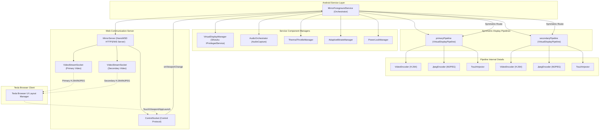

# MirrorForegroundService 핵심 아키텍처 및 구조도

본 문서는 `MirrorForegroundService`의 클래스 구조, 핵심 컴포넌트 간의 상호작용 흐름, 그리고 다중 가상 디스플레이(VD)가 어떻게 상호 간섭 없이 완전하게 대칭적이고 독립적으로 동작하는지를 설계 관점에서 상세히 설명합니다.

---

## 📌 1. 전체 시스템 아키텍처 (Mermaid Diagram)



---

## 📌 2. 핵심 컴포넌트 설명 및 역할 정의

### 1) `MirrorForegroundService` (Orchestrator)
- **역할**: 백그라운드에서 상주하며 가상 디스플레이 세션의 전체 수명 주기(Lifecycle)를 관리하는 컨트롤 타워입니다.
- **주요 속성**:
  - `primaryPipeline`: 메인 화면을 담당하는 `VirtualDisplayPipeline` 인스턴스.
  - `secondaryPipeline`: 보조 화면을 담당하는 `VirtualDisplayPipeline` 인스턴스.
  - `virtualDisplayManager`: Android 시스템 수준의 가상 디스플레이 API 및 Shizuku 권한 대행 서비스를 추상화합니다.
  - `mirrorServer`: 브라우저와 통신하기 위한 내장 웹서버입니다.

### 2) `VirtualDisplayPipeline` (Symmetric Display Pipeline)
- **역할**: 단일 가상 디스플레이가 필요로 하는 모든 상태(해상도, 인코더, 터치 주입기, 현재 앱 정보)를 캡슐화한 **독립 실행 단위**입니다. Primary와 Secondary 디스플레이가 동일한 클래스 인스턴스 2개로 완전히 대칭적으로 구동됩니다.
- **핵심 캡슐화 내역**:
  - **인코더 수명 주기**: `VideoEncoder` (H264) 및 `JpegEncoder` (MJPEG) 생성, 해제 및 데이터 브로드캐스트.
  - **콘텐츠 정보 관리**: `currentApp` (패키지명/컴포넌트명), `currentWebUrl` (웹 앱 주소), `vdGeneration` (가상 디스플레이 고유 세션 키).
  - **세션 검증**: `invalidateVd()`, `markVdCreated()`, `isCurrentVd()`, `currentVdToken()`.
  - **런칭 비즈니스 로직**: `launchBrowser()`, `launchStandard()`, `launchWeb()`, `restoreContent()` 등 콘텐츠 기동 및 복원 로직 수용.

### 3) `MirrorServer` & `ControlSocket` (Network & Protocol)
- **역할**: NanoWSD 기반으로 동작하는 WebSocket / HTTP 서버 및 통신 제어 소켓입니다.
- **제어 데이터 흐름**:
  - **비디오 스트림**: `/ws/video?channel=primary` 와 `/ws/video?channel=secondary` 두 채널로 독립적인 프레임을 송출합니다.
  - **통합 제어 프로토콜**: 클라이언트의 터치, 뷰포트 크기 변경, 앱 런칭 요청은 하나의 `ControlSocket`을 통해 수신되어 서비스 본체로 라우팅됩니다.

---

## 📌 3. 핵심 시나리오 및 흐름 제어

### 1) 앱 런칭 흐름 (Symmetric Launch Flow)
1. **신호 유입**: 브라우저 UI에서 앱 아이콘을 클릭하면 WebSocket으로 `launchApp` 혹은 `LAUNCH_APP_PAIR` 메시지가 발생합니다.
2. **프로토콜 디스패치**: `ControlSocket.kt`는 이 요청을 수신하여 `MirrorServer.onAppLaunchRequest(pkg, component, pane)`를 거쳐 서비스 리스너로 즉시 디스패치합니다.
3. **다이렉트 라우팅**: 서비스는 들어온 `pane` 매개변수에 기반하여 대상 파이프라인에 런칭을 위임합니다.
   ```kotlin
   val targetPipeline = if (pane == "secondary") secondaryPipeline else primaryPipeline
   targetPipeline.launchAppFromWebLauncher(pkgName, componentName)
   ```
4. **완전 독립 기동**: `launchAppFromWebLauncher`는 다른 파이프라인의 자원 해제나 화면 전환 등에 전혀 관여하지 않고, 오직 자신의 가상 디스플레이에 지정된 앱을 쉘(`am start`)로 기동합니다.

### 2) 뷰포트(Viewport) 변경 및 소멸 흐름 (Symmetric Viewport & Release Flow)
1. **레이아웃 변경**: 클라이언트 브라우저의 레이아웃이 단독(Single) 혹은 분할(Split) 상태로 바뀝니다.
2. **뷰포트 신호 전송**: 브라우저는 크기가 변경된 각 디스플레이의 해상도를 `viewport` 메시지로 전송합니다.
3. **해상도 변경 (기동)**:
   - 전송받은 크기가 `width > 0 && height > 0`인 경우: 해당 파이프라인의 `rebuild(w, h)`를 비동기 실행하여 인코더와 가상 디스플레이 해상도를 실시간 리사이징합니다.
4. **리소스 완전 소멸 (종료) - 0x0 Viewport**:
   - 세컨더리 화면을 닫을 경우 클라이언트가 `0x0` 크기를 보내거나 `"closeSecondary"` (0x0 매핑) 신호를 보내옵니다.
   - 해당 파이프라인은 크기가 `<= 0` 임을 인지하고 **자율적으로 리소스를 반납**합니다.
   ```kotlin
   if (width <= 0 || height <= 0) {
       releaseSecondaryPipeline() // 세컨더리 디스플레이 자원만 완전하고 깨끗하게 반납
       return
   }
   ```

---

## 📌 4. 유지보수 및 추가 리팩토링 가이드

1. **상호 참조(Cross-reference) 금지**:
   - `primaryPipeline` 객체 내부에서 `secondaryPipeline`을 조작하거나 그 반대의 조작을 가하는 코드는 절대 작성하지 마십시오.
   - 두 파이프라인의 조율이 필요한 영역(예: 양쪽 해상도 대비 비트레이트 분배 등)은 파이프라인 내부가 아닌 서비스 본체(`MirrorForegroundService` 오케스트레이터)의 전용 관리 메서드(예: `rebalanceDualDisplayBitrates`)에서만 단방향으로 처리되어야 합니다.
2. **이중 빌드 방지**:
   - 가상 디스플레이의 소멸/생성은 오직 **클라이언트 뷰포트 업데이트 신호**를 단일 진실 공급원(Single Source of Truth)으로 삼아 동작해야 합니다.
   - 서비스 내부 소멸 시점에 primary display를 강제로 흔들어 깨우는 식의 비동기 리빌드 루프를 절대 삽입하지 마십시오.
